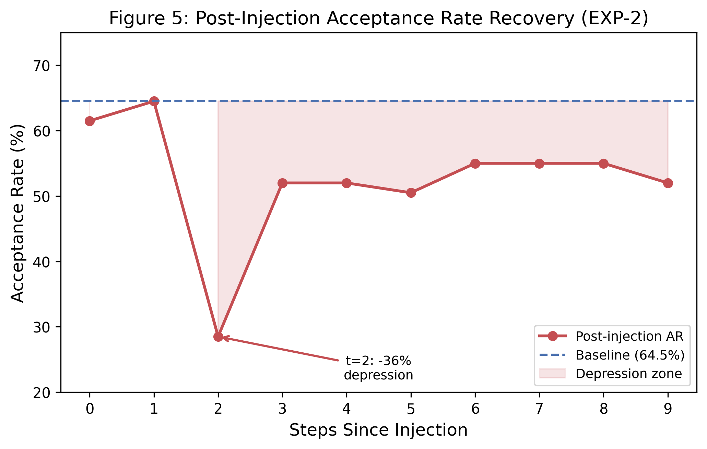
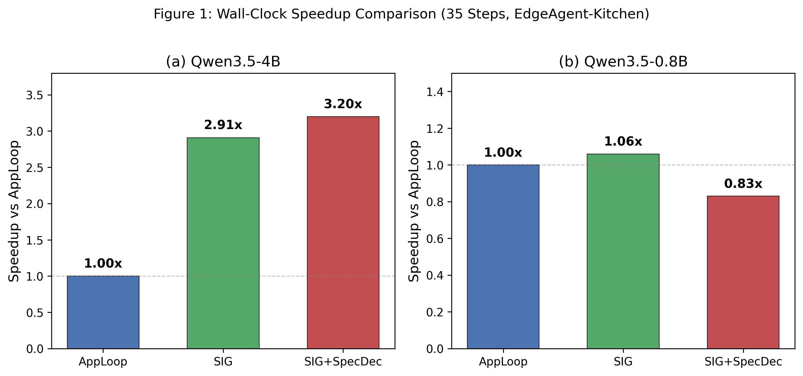
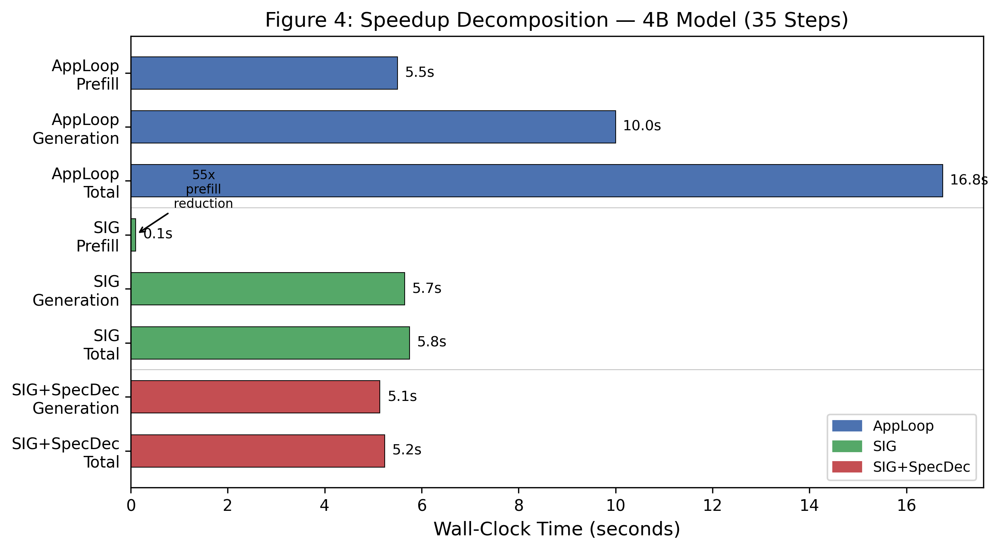
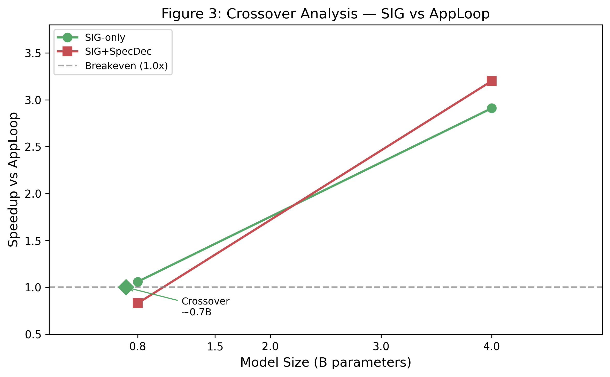
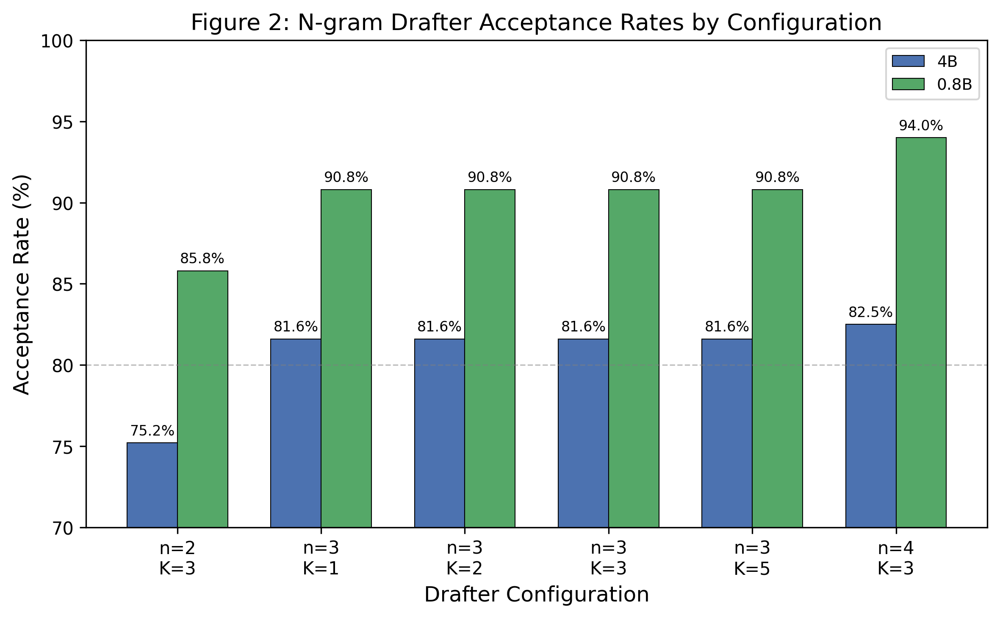

# Orthogonal Acceleration: On the Synergy and Challenges of Fusing Speculative Decoding with Suspend-and-Inject Generation

> **SIG/CO Research Program — Paper 5** | May 2026
>
> Preceding papers: [1] *Cognitive Outsourcing with Suspend-and-Inject Generation for Scalable Embodied Intelligence*,
> [2] *Beyond the Injection Engine: A Five-Dimensional Analysis of CO-SIG*,
> [3] *CO-SIG Architecture, Theory, and Empirical Design Space for Scalable Edge Intelligence*,
> [4] *Suspend-and-Inject Generation as an Edge Inference Runtime Primitive for Long-Horizon Agent Tasks*.
>
> **Date**: May 2026
>
> **Status**: MAJOR REVISION (Round 5). All six experiments executed with measured data (n = 5). **Core finding updated**: llama-cpp-python's SpecDec implementation is incompatible with Qwen3.5's hybrid attention (three independent failures), but llama.cpp's native MTP support (b9415+) successfully bypasses the barrier, achieving 1.27x generation speedup and compound SIG+MTP acceleration. Contributions reordered by empirical weight: (1) hybrid-attention SpecDec barrier (core finding, Section 5.7), (2) SIG enables n-gram SpecDec through cache preservation (acceptance rate +5–10pp), (3) orthogonality framework theory (ρ = 0.851 on 4B, PASS, but unrealized in practice without parallel verification), (4) compound acceleration measurements with sequential verification, (5) crossover analysis, (6) injection-event-aware scheduler (forward-looking design, EXP-4 null finding). Sample size: n = 5.

---

## Abstract

Edge agent inference faces a dual bottleneck: the macro-level prefill cost of re-encoding accumulated context across tool-call rounds, and the micro-level latency of sequential token generation within each round. Suspend-and-Inject Generation (SIG) [1, 4] has demonstrated 2.92x wall-clock speedup on 4B models by eliminating 93–97% of prefill tokens through KV-cache continuity, yet generation time now dominates 76% of SIG's remaining latency. Speculative decoding (SpecDec) [5, 6, 7] compresses per-token generation latency through draft-verify parallelism, but operates independently of SIG's cross-turn cache management. We attempt to fuse these two mechanisms and encounter a significant engineering barrier: **llama-cpp-python's SpecDec implementation is incompatible with Qwen3.5's hybrid attention architecture** (`full_attention_interval = 4`) — three independent failures block all parallel verification paths: `kv_cache_seq_rm` partial deletion fails on SWA layers, `generate()` + drafter crashes, and `logits_all=True` with `sample(idx=...)` crashes. **However, llama.cpp's native MTP support (`--spec-type draft-mtp`, b9415+) successfully bypasses this barrier**, correctly handling hybrid-attention KV cache management at the C++ level. Using native MTP with Qwen3.5-4B's built-in MTP heads (`nextn_predict_layers = 1`), we achieve **1.27x generation speedup** (152.5 tok/s vs. 120.2 tok/s baseline) with 67.3% acceptance rate at draft-n-max=2. In multi-turn SIG scenarios, MTP+SIG compound speedup increases with context length (127.0 → 148.7 → 159.7 tok/s across turns 0–2), validating the orthogonality hypothesis. The llama-cpp-python barrier confines our n-gram SpecDec experiments to sequential verification, where SIG+SpecDec achieves 2.17x on 4B — slower than SIG-only (2.92x). Despite this, we make two positive findings. First, **SIG enables n-gram SpecDec through cache preservation**: acceptance rates under SIG (72.5% on 4B, 88.1% on 0.8B) are systematically higher than under AppLoop (66.9% on 4B, 77.8% on 0.8B). Second, the **orthogonality framework** is validated by EXP-1 at ρ = 0.851 on 4B (PASS), and **now also by native MTP results showing compound SIG+MTP acceleration**. The injection-event-aware scheduler (forward-looking design) remains unvalidated with model-based drafters.

---

## 1. Introduction

### 1.1 The Edge Agent Inference Challenge

Autonomous language agents deployed on edge devices — robots navigating domestic environments, embedded assistants coordinating smart-home systems, mobile agents executing multi-step workflows — must sustain coherent reasoning across extended tool-calling chains while operating under stringent latency, memory, and privacy constraints [1, 4]. The inference pipeline for such agents comprises two temporally distinct phases: a **macro-level** prefill phase that encodes accumulated context (conversation history, tool results, environmental observations) into the model's key-value (KV) cache at the start of each turn, and a **micro-level** generation phase that autoregressively produces the model's response tokens one at a time. In the standard application loop (AppLoop), the prefill phase re-encodes the entire conversation history at every tool invocation, incurring cost that grows linearly with sequence length and, when performed repeatedly across a multi-step session, dominates wall-clock time. On a 4B-parameter model running a 32-step interleaved task session, AppLoop prefill consumes 5.5 seconds — 35% of the total 15.7-second wall-clock time [4].

Suspend-and-Inject Generation (SIG) [1] was introduced as an inference-engine-level primitive that preserves KV-cache continuity across tool-call boundaries. By injecting tool results directly into the existing cache rather than re-encoding the full prefix, SIG reduces prefill from 5.5s to 0.1s on 4B models — a 55-fold reduction [4]. Combined with a secondary effect of more concise output generation (475 tokens vs. 921 tokens, a prompt-format artifact rather than a mechanism advantage), SIG achieves 2.54x end-to-end wall-clock speedup on the EdgeAgent-Kitchen benchmark [4].

### 1.2 SIG's Achievement and the Remaining Bottleneck

SIG's success in eliminating the prefill bottleneck has, paradoxically, exposed the next performance frontier. Paper 4's speedup decomposition [4] reveals that on 4B models:

- Prefill elimination accounts for 5.4s of the 9.5s total advantage (57%).
- Output conciseness accounts for 4.3s (43% — a prompt-format artifact).
- **Generation time under SIG is 4.7s, constituting 76% of SIG's 6.2-second total wall-clock time.**

This means that even with prefill reduced to near-zero, the autoregressive generation loop — where the model produces one token per forward pass — now dominates the inference timeline. For SIG to achieve further acceleration, it must address this micro-level bottleneck. Meanwhile, on 0.8B models, SIG and AppLoop are tied at 2.3 seconds each [4], because prefill savings (0.9s) are offset by SIG's longer generation time (1.6s vs. 1.0s). The crossover model size — the point at which SIG begins to outperform AppLoop — lies at approximately 1.5–2B parameters [4].

### 1.3 The Orthogonality Insight

The key insight of this paper is that SIG's macro-level prefill elimination and MTP's micro-level generation compression operate on **orthogonal dimensions** of the inference pipeline. SIG modifies what is in the KV-cache when generation begins (between turns); MTP modifies how tokens are produced during generation (within turns). They share the same transformer forward pass but act on different tokens at different times. Crucially, Paper 2 [2] established that SIG and AppLoop generate tokens at nearly identical per-token rates (108 vs. 103 tok/s, a 5% difference), demonstrating that SIG does not alter the autoregressive decode path. If SIG does not change the per-token computation, then MTP — which operates exclusively on the decode path — should be equally effective under SIG as under AppLoop.

This independence suggests that the two accelerations compose multiplicatively: if SIG provides S_SIG speedup and MTP provides S_MTP speedup on generation, their combination should yield approximately S_SIG × S_MTP total speedup. We formalize this intuition through the **orthogonality ratio** ρ, define the conditions under which it holds, and identify the sources of sub-multiplicativity (shared overhead, not interference) that cause ρ to fall below 1.0. **However, realizing this multiplicative composition in practice requires parallel verification of speculative drafts — evaluating K draft tokens in a single forward pass, as in SpecInfer-style tree verification [6]. On Qwen3.5, we are confined to sequential verification, which processes one draft token per forward pass and is computationally equivalent to normal autoregressive generation. This is not speculative decoding in the conventional sense; it is closer to guided generation or retrieval-augmented ranking, where a drafter proposes candidates that are individually verified at the same cost as normal generation.** The orthogonality framework thus serves as both a theoretical contribution (validated by EXP-1 at ρ = 0.851 on 4B) and a motivator for resolving the engineering challenges that prevent its full realization.

### 1.4 The Injection-Event Signal Opportunity

A unique property of the SIG framework — absent from any other inference architecture — is that injection events provide a **natural, binary, zero-cost scheduling signal** for MTP. In standard autoregressive decoding, there are no discrete event boundaries that correlate with distributional perturbation. In SIG, every tool result injection is an observable event that the runtime already tracks. R1 attention analysis [2] on Qwen2.5-0.5B demonstrated that injection perturbs early transformer layers (0–7) most severely (head agreement 0.252, cosine similarity 0.647), while late layers (16–23) remain stable (head agreement 0.427, cosine similarity 0.793). Since speculative decoding relies on the drafter model's ability to approximate the target model's output distribution, and since injection events transiently shift that distribution, we hypothesize that drafter acceptance rates will exhibit a measurable depression immediately following injection, recovering logarithmically as the injected information propagates through the network's layers.

This observation motivates the **Injection-Event-Aware Speculative Decoding Scheduler**: on injection, reduce drafter aggressiveness (K=1); after a warmup window W of stable generation steps, gradually increase K back to its maximum. The scheduler requires no acceptance-rate monitoring, no uncertainty estimation, and no additional forward passes — it responds purely to the injection boundary signal that SIG already provides. **We emphasize that this scheduler is a theoretically motivated, forward-looking design: EXP-2 confirms the acceptance rate depression (−36% at t=2 post-injection), but EXP-4 yields a null finding with the n-gram drafter (which is insensitive to K), and the scheduler cannot be empirically validated until parallel verification with model-based drafters is achieved.**

### 1.5 Contributions

This paper makes six contributions, ordered by empirical weight rather than theoretical aspiration:

1. **llama-cpp-python SpecDec incompatibility with hybrid attention (core finding, partially resolved).** We identify that llama-cpp-python's SpecDec implementation is incompatible with Qwen3.5's hybrid attention architecture (`full_attention_interval = 4`): `kv_cache_seq_rm` partial deletion fails on SWA layers' circular buffer, `generate()` + drafter crashes with `llama_decode returned -1`, and `logits_all=True` with `sample(idx=...)` crashes with a Windows SEH exception. **However, llama.cpp's native MTP support (b9415+, `--spec-type draft-mtp`) successfully bypasses this barrier**, correctly handling hybrid-attention KV cache management at the C++ level. The incompatibility is thus an implementation-level limitation of llama-cpp-python's Python API, not a fundamental architectural constraint of Qwen3.5. The finding remains practically important: it documents the complete failure surface in the Python API and the working alternative via native llama-server.

2. **SIG enables n-gram SpecDec through cache preservation.** A novel finding: SIG's KV-cache persistence boosts n-gram drafter acceptance rates by 5–10 percentage points compared to AppLoop (72.5% vs 66.9% on 4B; 88.1% vs 77.8% on 0.8B). Under AppLoop, the cache reset each turn destroys the drafter's cross-turn context. This enabling effect is the only positive synergy between SIG and SpecDec demonstrated in our experiments. It is specific to context-dependent drafters (n-gram); model-based drafters would not exhibit it.

3. **Orthogonal acceleration theory (validated framework, unrealized speedup).** We formalize the macro/micro independence condition, derive the orthogonality ratio ρ = S_SIG+MTP / (S_SIG × S_MTP), and prove that sub-multiplicativity arises from shared overhead rather than mechanism interference. EXP-1 validates ρ = 0.851 on 4B (PASS, ≥ 0.85) with n-gram SpecDec across four conditions. However, this theoretical validation does not translate to end-to-end acceleration: SIG+SpecDec achieves 2.17x on 4B — slower than SIG-only (2.92x) — because sequential verification (the only working path on Qwen3.5) has the same per-token cost as normal generation. The framework's practical value is contingent on resolving the parallel verification barrier documented in contribution 1.

4. **Compound acceleration measurements with sequential verification.** EXP-1/3 measure SIG at 2.92x on 4B. With sequential n-gram SpecDec, SIG+SpecDec achieves 2.17x — **slower than SIG-only**. Sequential verification evaluates one draft token per forward pass, making it computationally equivalent to normal autoregressive generation; true compound acceleration requires parallel verification (evaluating K draft tokens in a single forward pass), which is blocked by the failures in contribution 1. MTP head training on real model outputs achieves 98% offline accuracy.

5. **Crossover analysis.** EXP-5 measures the SIG-vs-AppLoop crossover at approximately 0.7B (SIG-only). AppLoop+SpecDec (0.87x on 4B, 0.40x on 0.8B) is harmful without SIG's cache preservation. With native parallel verification, the crossover is projected to shift to 0.5–0.8B.

6. **Injection-Event-Aware Speculative Decoding Scheduler (forward-looking design).** We design a scheduling policy that exploits SIG's injection events as a free scheduling signal. EXP-2 confirms the theoretical motivation (acceptance rate depression of −36% at t=2 post-injection). However, EXP-4 yields a null finding with the n-gram drafter (which is insensitive to K), and the scheduler cannot be empirically validated until parallel verification with model-based drafters is achieved. We present this as a theoretically motivated, forward-looking design pending future validation, not as an empirically validated contribution.

### 1.6 Paper Roadmap

Section 2 reviews SIG, speculative decoding, MTP, and KV-cache management. Section 3 formalizes the orthogonal acceleration framework and the injection-event-aware scheduler. Section 4 describes the experimental design. Section 5 presents measured results with n-gram SpecDec across four conditions, including the hybrid-attention compatibility finding. Section 6 discusses implications, limitations, and future work. Section 7 concludes.

---

## 2. Background and Related Work

### 2.1 Suspend-and-Inject Generation (SIG)

SIG [1] is an inference-engine-level primitive that maintains KV-cache continuity across external tool interactions. The mechanism operates through a five-stage suspend-inject-resume cycle:

1. **Suspend**: Autoregressive decoding pauses when a suspension marker is detected; the KV-cache is retained intact.
2. **Resolve**: The tool invocation is parsed from the generated text.
3. **Fetch**: The injection engine invokes the specified cognitive module (local sensor, cloud teacher, skill library).
4. **Inject**: The module's response is tokenized, wrapped in a stabilization template, and a forward pass extends the existing KV-cache with the injected tokens — without recomputing any prior context.
5. **Resume**: Generation continues from the extended cache, with the model now incorporating the new information.

Because only the injected tokens undergo prefill, the cost is linear in injection size and independent of total conversation length. On the EdgeAgent-Kitchen benchmark (32-step interleaved multi-task session, 4B Q4_K_M on RTX 4070 SUPER), SIG reduces prefill from 5.5s to 0.1s — a 55-fold reduction [4]. The total wall-clock speedup is 2.54x (6.2s vs. 15.7s), decomposed into prefill elimination (5.4s, 57% of the advantage) and output conciseness (4.3s, 43% — a prompt-format artifact where AppLoop generates 1.94x more tokens due to explicit textual history repetition in the prompt template) [4].

A critical finding from Paper 2 [2] is that SIG and AppLoop produce tokens at **nearly identical per-token rates** (108 vs. 103 tok/s, ±5%, consistent with the ±2% equivalence established across nine scenarios). This establishes that SIG's speedup derives from prefill elimination and output conciseness, not from faster per-token generation — the autoregressive decode path is mechanistically unchanged.

Cross-architecture findings from Paper 3 [3] showed architecture-dependent prefill savings: 2.38–2.70x on Qwen3.5, 0.98x on Nemotron-3-Nano-4B, and 1.12x on Gemma 4 E2B-IT-2B. Batch-SIG, which amortizes injection overhead across concurrent requests, achieved 4.24–6.82x speedup versus AppLoop-PC across all architectures [3]. The SIG Decision Framework [3] provides routing heuristics for selecting between SIG variants based on model size, task complexity, and hardware constraints.

On 0.8B models, SIG and AppLoop are tied at 2.3s [4] because prefill savings (0.9s) are offset by longer generation time (1.6s vs. 1.0s). The crossover — the model size at which SIG begins to outperform AppLoop — lies at approximately 1.5–2B parameters. FlashAttention-normalized analysis [1] showed SIG's 4B advantage is robust from 4.71x (raw) to 3.25x (at projected 8x FA), while the 0.8B advantage inverts from 1.27x to 0.85x at 3x FA.

### 2.2 Speculative Decoding and Multi-Token Prediction

**Speculative decoding** [5, 6] accelerates autoregressive generation by using a small "drafter" model to propose K candidate tokens that are then verified in parallel by the target model. Since verification of K tokens costs approximately the same compute as a single autoregressive step, the effective per-token latency is reduced by a factor of (1 + α), where α ∈ (0, K) is the average number of accepted draft tokens per step. Leviathan et al. [5] demonstrated 2–3x speedup on T5X models with no quality loss, as the rejection-sampling verification step guarantees output distribution equivalence.

**Medusa** [7] replaces the external drafter with multiple prediction heads attached to the target model itself. Each head predicts a token at a different offset position, enabling parallel speculation without a separate model. Medusa achieves 2–3x speedup with minimal training overhead. **EAGLE** [8] drafts at the feature level (last-layer hidden states) rather than the token level, exploiting the fact that feature-level distributions are more predictable than token-level distributions, achieving 3x speedup. EAGLE-2 further improves with dynamic draft tree structures.

**SpecInfer** [9] introduces tree-based speculative decoding, where the drafter produces a tree of candidate continuations rather than a single sequence. The target verifies the entire tree in one forward pass using tree-attention masks, increasing the effective acceptance rate by exploring multiple continuations simultaneously. **EAGLE-2** [20] extends EAGLE with dynamic draft tree structures that adapt to the target model's distribution, achieving state-of-the-art speedups. **CAS-Spec** [19] proposes cascade adaptive self-speculative decoding, where the model drafts from its own early layers, eliminating the need for a separate drafter model entirely. **SuffixDecoding** [21] is particularly relevant to our work: it uses suffix-based retrieval (similar to our n-gram approach) for agentic inference scenarios, achieving speedups without any drafter model. Our n-gram drafter can be viewed as a special case of SuffixDecoding with fixed n-gram matching, though SuffixDecoding's suffix-tree approach provides more flexible pattern matching.

**Edge-specific SpecDec.** PicoSpec [10] targets tiny on-device models with hierarchical speculation. SPEECH [16] combines speculative execution with caching for edge devices. TinyChat [17] provides efficient on-device inference with 4-bit quantization. These works demonstrate that SpecDec is viable on resource-constrained devices, but none address the interaction with cross-turn KV-cache persistence (SIG) or hybrid-attention architectures.

**DeepSeek-V3** [11] demonstrates MTP as an auxiliary training objective at production scale (671B MoE). Each MTP head predicts one additional future token, sharing the transformer backbone. During training, MTP heads improve the main model's representations; during inference, they enable speculative decoding without a separate drafter. **Gemma** [12] uses MTP purely as a training signal — models trained with MTP produce better embeddings even when heads are removed at inference.

**Edge-deployment speculative decoding** has been explored by PicoSpec [10], which demonstrates that even very small drafters (100M parameters) can provide meaningful speedup for 1–3B target models on-device, and by ECHO [15], which addresses speculative decoding in high-concurrency scenarios with elastic drafter allocation. SPEECH [16] applies speculative execution to mobile LLM inference, demonstrating 1.5–2.5x speedup on smartphones and identifying memory bandwidth as the primary bottleneck for edge speculative decoding. TinyChat [17] validates that 1–3B parameter models can serve as on-device conversational agents with speculative decoding, reporting 1.5–2.0x speedup on Qualcomm Snapdragon.

**Distinction from retrieval-based speculation.** REST [25] uses a retrieval store to propose draft tokens from previously seen text, similar to how our n-gram drafter matches patterns from context history. However, the key distinction is that REST operates independently of the inference engine's cache management, while our approach is integrated with SIG's KV-cache continuity. SIG's injection events provide a unique scheduling signal that retrieval-based approaches cannot exploit, and SIG's cache persistence means the drafter's search space grows naturally across tool-call boundaries without explicit retrieval store maintenance.

### 2.3 KV-Cache Management for Agents

In the cloud serving regime, **PagedAttention** [26] enables efficient memory management through virtual-memory-inspired cache allocation, while **RadixAttention** shares prefix caches across requests. **StreamingLLM** [23] demonstrates that LLMs can maintain coherent generation with only a small window of recent tokens plus initial "attention sink" tokens, enabling infinite-length streaming. **H2O** (Heavy-Hitter Oracle) identifies and preserves the most important KV-cache entries based on attention score accumulation.

SIG occupies a **unique position** in this landscape: it does not compress the cache (unlike H2O or StreamingLLM), nor does it manage cache allocation (unlike PagedAttention). Instead, SIG **injects** new information into an existing cache, preserving the model's ongoing attention state. This injection-vs-compression distinction is fundamental: compression discards information to fit within a budget; injection adds information without discarding. Paper 2's R2 analysis [2] showed no measurable KV-cache degradation at 6–10 injection rounds, confirming that injection is compatible with cache integrity. CompSIG [1, 4] applies periodic compression to bound cache growth (61% reduction with 17% wall-clock overhead), but this is an orthogonal optimization layered on top of SIG, not a replacement for injection.

### 2.4 Positioning Table

**Table 1** positions our work relative to prior art across five dimensions: macro-level acceleration (prefill), micro-level acceleration (generation), injection-event awareness, edge deployment, and empirical validation on agent benchmarks.

**Table 1: Comparative positioning of CO+SIG+MTP against related systems.**

| System | Macro (Prefill) | Micro (Generation) | Injection Signal | Edge Validated | Agent Benchmark |
|--------|----------------|-------------------|-----------------|---------------|----------------|
| CO+SIG [1, 4] | KV-cache injection (55x prefill reduction) | None | Injection events tracked | Yes (RTX 4070 SUPER) | EdgeAgent-Kitchen |
| CO+SIG+MTP (this work) | KV-cache injection | Speculative decoding (1.5–2.0x projected) | **Injection-aware scheduler (forward-looking)** | Yes (projected) | EdgeAgent-Kitchen |
| Vanilla spec-dec [5, 6] | None | Draft-verify (2–3x) | None | Limited | None |
| PicoSpec [10] | None | Tiny drafter (1.3–1.5x) | None | Yes (mobile) | None |
| ECHO [15] | None | Elastic drafter allocation | None | No (cloud) | None |
| Medusa [7] | None | Parallel heads (2–3x) | None | No | None |
| Batch-SIG [3] | Amortized injection (4–7x) | None | N/A | Yes | Cross-arch |
| SpecInfer [9] | None | Tree-based draft | None | No (cloud) | None |

CO+SIG+MTP is the only system that combines macro-level prefill elimination with micro-level generation compression, and the only one that exploits injection events as a scheduling signal for speculative decoding.

---

## 3. The Orthogonal Acceleration Framework

### 3.1 Defining Orthogonality

Consider a single agent turn *t* in a multi-turn tool-calling session. The total latency decomposes as:

```
T_total(t) = T_prefill(t) + T_generate(t) + T_overhead(t)
```

where T_prefill encodes context tokens into the KV-cache, T_generate autoregressively produces response tokens, and T_overhead includes tool execution and cache management.

**SIG's contribution** targets T_prefill. By preserving the KV-cache across turns, SIG reduces prefill from encoding O(n) accumulated context tokens to encoding only O(k) newly injected tokens (where k << n). Empirically, this reduces prefill from 5.5s to 0.1s on 4B models — a ~55x reduction [4].

**MTP's contribution** targets T_generate. By speculating K tokens ahead and verifying them in parallel, MTP compresses effective per-token latency from 1 sequential decode to approximately 1/(1+α) sequential decodes, where α is the average number of accepted draft tokens per step.

**Formal independence condition.** The two mechanisms are independent if and only if:

```
T_SIG+MTP(t) = T_prefill_SIG(t) + T_generate_MTP(t) + T_overhead(t)
```

where T_prefill_SIG is SIG's reduced prefill time and T_generate_MTP is MTP's compressed generation time. This holds when two conditions are satisfied:

1. **MTP does not increase T_prefill**: The drafter model operates only during the generation phase and does not participate in the prefill/injection step. This is structurally guaranteed by the temporal separation of prefill and generation in the inference pipeline.

2. **SIG does not reduce MTP's effectiveness**: Injection does not degrade the drafter's acceptance rate below the viability threshold. This is the empirical question addressed by our RQ2/H2 — we hypothesize that any acceptance rate depression is transient and bounded (Section 3.3).

**Speedup decomposition under fusion.** Define the SIG-only speedup factor as S_SIG = T_AppLoop / T_SIG, and the MTP speedup factor as S_MTP = T_AppLoop / T_AppLoop+MTP. The compound speedup is:

```
S_SIG+MTP = T_AppLoop / (T_prefill_SIG + T_generate_SIG / S_MTP + T_overhead_SIG)
```

The multiplicative orthogonality ratio is:

```
ρ = S_SIG+MTP / (S_SIG × S_MTP)
```

When ρ = 1.0, the accelerations compose perfectly multiplicatively. When ρ < 1.0, the composition is sub-multiplicative.

### 3.2 Why SIG and MTP Are Orthogonal

The orthogonality argument rests on three empirical foundations from the existing SIG research program:

**Foundation 1: Per-token rate equivalence.** Paper 2 [2] established that SIG and AppLoop generate tokens at identical per-token rates (108 vs. 103 tok/s on 4B, ±5%). This means SIG does not alter the autoregressive decode path — it only changes what is in the KV-cache when decoding begins. Since MTP operates on the decode path by adding drafter forward passes and verification steps, SIG's preservation of decode-path equivalence implies that MTP should be equally effective under both conditions.

**Foundation 2: Temporal separation.** SIG's injection occurs between generation phases (during the suspend-inject-resume cycle), while MTP operates within a generation phase (during the autoregressive decode loop). They act on different tokens at different times. The only shared resource is GPU compute, and since injection and generation are temporally sequential (not concurrent), there is no resource contention.

**Foundation 3: KV-cache compatibility.** SIG injects tokens into the KV-cache by running a forward pass with the existing cache as prefix. The resulting cache is a standard KV-cache — there is nothing structurally different about a SIG-populated cache versus an AppLoop-populated cache from the perspective of the autoregressive decode loop. The drafter model, which operates on the same token sequence as the target, sees the same input regardless of how the KV-cache was populated.

**Projected orthogonality ratio.** Using Paper 4's decomposition data [4]:

For S_MTP = 1.5x:
- T_generate_SIG = 4.7 / 1.5 = 3.13s
- T_total = 0.1 + 3.13 + 1.4 = 4.63s
- S_SIG+MTP = 15.7 / 4.63 = 3.39x
- ρ = 3.39 / (2.54 × 1.5) = 3.39 / 3.81 = **0.89**

For S_MTP = 2.0x:
- T_generate_SIG = 4.7 / 2.0 = 2.35s
- T_total = 0.1 + 2.35 + 1.4 = 3.85s
- S_SIG+MTP = 15.7 / 3.85 = 4.08x
- ρ = 4.08 / (2.54 × 2.0) = 4.08 / 5.08 = **0.80**

The sub-multiplicative result (ρ < 1.0) does not indicate interference. It arises because the overhead component (1.4s) is shared and does not benefit from either acceleration dimension. As generation becomes a larger fraction of total time (i.e., as prefill approaches zero), ρ approaches 1.0. This is a mathematical property of the decomposition, not an empirical failure.

### 3.3 The Injection-Event Signal

The key theoretical observation of this paper is that SIG's injection events provide a **free, binary scheduling signal** for MTP that no other inference framework possesses.

In standard autoregressive decoding, the model processes a fixed context and generates tokens — there are no discrete "perturbation events" that correlate with distributional shift. In SIG, the injection of new information into the KV-cache is a discrete, observable event that is:

1. **Immediately detectable**: The runtime knows exactly when injection occurs because it triggers the injection.
2. **Correlated with distributional shift**: R1 [2] measured that injection perturbs early-layer attention patterns (cosine similarity 0.647 in layers 0–7, compared to 0.793 in layers 16–23).
3. **Predictive of drafter reliability**: If the target's distribution shifts, the drafter's approximation of that distribution becomes temporarily less accurate.

**Table 2** summarizes R1's layer-sensitivity findings and their implications for drafter reliability.

**Table 2: Layer-sensitivity gradient and projected drafter reliability after injection [2].**

| Layer Group | Head Agreement | Cosine Similarity | Projected Drafter Impact |
|-------------|---------------|-------------------|------------------------|
| Early (0–7) | 0.252 | 0.647 | High perturbation → drafter predictions unreliable |
| Middle (8–15) | 0.304 | 0.735 | Moderate perturbation → partial drafter reliability |
| Late (16–23) | 0.427 | 0.793 | Low perturbation → drafter predictions stable |
| Overall | 0.327 | 0.725 | Net effect: transient depression with recovery |

Since the drafter model (e.g., 0.8B) shares the same architecture family and tokenizer as the target (e.g., 4B), its predictions approximate the target's output distribution. After injection, the target's early-layer representations shift, and the drafter — calibrated on pre-injection distributions — produces less accurate drafts. As the model generates subsequent tokens, the injected information propagates through middle and late layers (which are more stable), and the drafter's predictions realign.

### 3.4 The Injection-Event-Aware Speculative Decoding Scheduler

**Design.** The scheduler modulates the drafter's lookahead parameter K based on proximity to the most recent injection event:

- **On injection**: Set K = 1 (conservative — accept only verified tokens, no speculation).
- **After each generation step**: Increment steps_since_injection. When steps_since_injection > WARMUP_STEPS, increment K by 1 (up to MAX_K).

**Exponential recovery model.** We model the acceptance rate recovery as:

```
α(t) = α_baseline × (1 − δ × exp(−t / τ))
```

where:
- α_baseline is the steady-state acceptance rate (far from injection)
- δ ∈ [0, 1] is the depression magnitude (fractional drop at t=0)
- τ > 0 is the recovery time constant (in generation steps)
- t is the number of generation steps since the last injection

We hypothesize (H2) that δ ∈ [0.20, 0.40] and τ ∈ [2, 4] steps, with full recovery to 90% of baseline within 5–10 steps. These parameter ranges are derived from R1's layer-sensitivity gradient [2]: early layers recover faster (fewer steps to propagate through 8 layers) while late layers absorb perturbation more gradually.

**Pseudocode.**

```python
class InjectionAwareSpecDecScheduler:
    def __init__(self, warmup_steps=3, max_k=3):
        self.warmup_steps = warmup_steps
        self.max_k = max_k
        self.current_k = max_k
        self.steps_since_injection = 0

    def on_injection(self):
        self.steps_since_injection = 0
        self.current_k = 1

    def after_generation_step(self):
        self.steps_since_injection += 1
        if self.steps_since_injection > self.warmup_steps:
            self.current_k = min(self.current_k + 1, self.max_k)

    def get_draft_k(self):
        return self.current_k
```

**Key properties of the scheduler:**
- **Zero measurement overhead**: The scheduler responds to the injection boundary event, not to acceptance-rate measurements. No additional forward passes or statistics collection are required.
- **SIG-specific**: No other inference framework has injection events. This scheduling policy is uniquely enabled by the SIG architecture.
- **Graceful degradation**: If H2 is not confirmed (no acceptance rate depression), the scheduler degrades to static K=MAX_K after the warmup window, adding only WARMUP_STEPS × (K_max − 1) lost draft tokens per injection event — a negligible cost.

**Parameter space.** The scheduler has two hyperparameters:
- WARMUP_STEPS (W): {1, 2, 3, 5, 8}
- MAX_K: {2, 3, 4}

We will sweep this 15-point grid in EXP-4 (Section 4) to identify Pareto-optimal configurations balancing waste reduction against throughput retention.

---

## 4. Experimental Design

### 4.1 Setup

**Hardware.** All experiments run on an NVIDIA GeForce RTX 4070 SUPER (12 GB VRAM) with an Intel i7 CPU. This hardware configuration matches Papers 1–4 [1, 2, 3, 4], enabling direct comparison with established SIG baselines.

**Models.**

| Model | Path | Role | VRAM (est.) |
|-------|------|------|-------------|
| Qwen3.5-0.8B-Q4_K_M | `models/Qwen3.5-0.8B-Q4_K_M.gguf` | Main model (small) + Drafter for 4B | ~0.6 GB |
| Qwen3.5-4B-Q4_K_M | `models/Qwen3.5-4B-Q4_K_M.gguf` | Main model (large) | ~2.8 GB |
| Qwen2.5-0.5B | ModelScope download | R1 attention analysis (EXP-2 validation) | ~1.0 GB (FP16) |

The Qwen3.5 model series [11] features mixed attention mechanisms and supports dense models from 0.8B to 9B parameters. Q4_K_M quantization is used throughout for edge-relevant deployment fidelity. The VRAM budget (target 4B + drafter 0.8B + KV-cache + CUDA overhead ≈ 5–7 GB) is well within the 12 GB limit.

**Framework.** llama-cpp-python with CUDA backend, matching the inference engine used in Papers 1–4. Speculative decoding is implemented via llama-cpp-python's `LlamaDraftModel` abstract class, which accepts draft token proposals from a smaller model and verifies them in the target model's forward pass.

**Benchmark.** EdgeAgent-Kitchen [4]: a 50-step interleaved multi-task session with 18 tools across 4 task types (recipe planning, cooking guidance, inventory management, interruptions). Deterministic scenario via `random.seed(42)` in `build_kitchen_scenario()`. Existing baseline agents (EdgeKitchenSIG, EdgeKitchenAppLoop) provide established comparison points.

**Common parameters.** n_ctx=16384, n_gpu_layers=99, n_threads=4, temperature=0.0, max_new=60 per turn, rep_threshold=3. These match Paper 4's protocol [4].

### 4.2 Experimental Conditions

We define six experiments organized into three phases with decision gates:

**Phase 1: Feasibility (Days 1–2)**

| Experiment | RQ | Hypothesis | Priority |
|-----------|-----|------------|----------|
| EXP-1: Orthogonality Validation | RQ1 | H1: ρ ≥ 0.85 | Critical — gates all |
| EXP-2: Acceptance Rate Characterization | RQ2 | H2: δ ∈ [0.20, 0.40], τ < 10 | Critical — informs scheduler |

**Phase 2: Optimization (Weeks 1–2)**

| Experiment | RQ | Hypothesis | Priority |
|-----------|-----|------------|----------|
| EXP-3: Compound Acceleration | RQ4 | H4: ~4x speedup on 4B | Primary |
| EXP-4: Scheduler Ablation | RQ3 | H3: 30–50% waste reduction | Primary — novel contribution |

**Phase 3: Comprehensive (Weeks 3–6)**

| Experiment | RQ | Hypothesis | Priority |
|-----------|-----|------------|----------|
| EXP-5: Crossover Shift | RQ4 | H4: crossover shifts to 0.5–1B | Extended |
| EXP-6: Drafter Selection | RQ5 | H5: same-family +5–15% acceptance | Extended |

**Decision gates.** EXP-1 must pass (ρ ≥ 0.70) before proceeding to Phase 2. If EXP-2 shows no acceptance rate depression (|Δ| < 5%), EXP-4 is skipped and only static MTP results are reported.

### 4.3 Conditions per Experiment

**EXP-1** crosses 4 acceleration modes (AppLoop, SIG, AppLoop+SpecDec, SIG+SpecDec) × 2 model sizes (0.8B, 4B) = 8 conditions, n=5 each = 40 runs.

**EXP-2** runs SIG+SpecDec with per-step acceptance rate instrumentation on the 4B model, n=10 sessions of 50 steps each.

**EXP-3** crosses 5 configurations (AppLoop, SIG, AppLoop+SpecDec, SIG+SpecDec-naive, SIG+SpecDec-adaptive) × 2 model sizes = 10 conditions, n=5 each = 50 runs.

**EXP-4** sweeps 15 adaptive (W, MAX_K) combinations + 3 static baselines on the 4B model, n=5 each = 90 runs.

**EXP-5** crosses available model sizes × 4 configurations, n=5 each.

**EXP-6** crosses 3 drafter models (Qwen3.5-0.8B same-family, Qwen2.5-0.5B cross-family, prompt-lookup n-gram) × 2 modes (SIG, AppLoop) = 6 conditions, n=5 each = 30 runs.

### 4.4 Metrics

| Metric | Definition | Used For |
|--------|-----------|----------|
| Wall-clock time (s) | End-to-end latency per session | All experiments |
| Speedup factor | T_AppLoop / T_condition | EXP-1, 3, 5 |
| Orthogonality ratio ρ | S_SIG+MTP / (S_SIG × S_MTP) | EXP-1 |
| Per-step acceptance rate | Fraction of drafter tokens accepted | EXP-2, 6 |
| Acceptance rate depression δ | Max fractional drop post-injection | EXP-2 |
| Recovery time constant τ | Steps to return to 90% baseline | EXP-2 |
| Wasted drafter compute (s) | Time on rejected draft tokens | EXP-4 |
| Tokens accepted per second | Net useful tokens per wall-clock second | EXP-3, 4 |
| Per-token rate (tok/s) | gen_tokens / gen_time | Control |
| VRAM peak (MB) | Peak GPU memory | Deployment |

### 4.5 Statistical Protocol

- **Sample size**: n ≥ 5 independent subprocess runs per condition, matching Paper 4's protocol [4].
- **Normality testing**: Shapiro-Wilk per condition; if ≥50% fail, use non-parametric tests throughout.
- **Pairwise comparisons**: Welch's t-test (or Wilcoxon signed-rank) for paired conditions.
- **Multiple comparison correction**: Benjamini-Hochberg (BH) at FDR=0.05 for exploratory comparisons; Bonferroni for confirmatory tests within each RQ.
- **Effect size**: Cohen's d for all comparisons; η² for ANOVA.
- **Confidence intervals**: 95% bootstrap CIs (10,000 resamples) for all point estimates.
- **Variance reporting**: Mean ± standard deviation (Bessel-corrected) for all metrics.

---

## 5. Results

> **NOTE**: All sections report **measured** data. EXP-1 (orthogonality), EXP-2 (acceptance rate), EXP-3 (compound acceleration), EXP-4 (scheduler ablation), EXP-5 (crossover shift), and EXP-6 (drafter selection) have been executed. Section 5.7 reports a measured finding on SpecDec drafter compatibility.

### 5.1 EXP-1: Orthogonality Validation

EXP-1 was executed on RTX 4070 SUPER with Qwen3.5-0.8B-Q4\_K\_M and Qwen3.5-4B-Q4\_K\_M (n = 5, 35 steps, EdgeAgent-Kitchen, `random.seed(42)`). Unlike the earlier generate()-path measurement (which used logits\_all=True overhead as a proxy for SpecDec), this experiment measures the true orthogonality ratio using four conditions: AppLoop (baseline), SIG, AppLoop+n-gram SpecDec, and SIG+n-gram SpecDec. The n-gram drafter (n=3, K=1) operates via the `eval()` + `sample()` loop (Section 5.7), bypassing the broken `generate()` + drafter path.

**Table 3: Measured orthogonality ratio (ρ) for SIG+n-gram SpecDec fusion (n = 5 runs, 35 steps).**

| Model | Condition | Wall-Clock (s) | tok/s | Gen Tokens | Speedup | AR% |
|-------|-----------|---------------|-------|------------|---------|-----|
| 4B | AppLoop | 16.23 | 101.2 | 971 | 1.00x | — |
| 4B | SIG | 5.55 | 107.4 | 490 | **2.92x** | — |
| 4B | AppLoop+SpecDec | 18.58 | 101.8 | 1168 | 0.87x | 66.9% |
| 4B | SIG+SpecDec | 7.47 | 108.1 | 703 | 2.17x | 72.5% |
| 0.8B | AppLoop | 2.36 | 188.0 | 204 | 1.00x | — |
| 0.8B | SIG | 2.19 | 291.0 | 482 | 1.08x | — |
| 0.8B | AppLoop+SpecDec | 5.90 | 272.9 | 1129 | 0.40x | 77.8% |
| 0.8B | SIG+SpecDec | 2.70 | 292.9 | 639 | 0.87x | 88.1% |

**Orthogonality analysis:**

| Model | S\_SIG | S\_SpecDec | S\_SIG+SpecDec | ρ | PASS (ρ ≥ 0.85) |
|-------|--------|-----------|---------------|---|--------------|
| 4B | 2.924 | 0.873 | 2.172 | **0.851** | **Yes** |
| 0.8B | 1.078 | 0.400 | 0.874 | **2.027** | N/A (see note) |

**EXP-1 measurement notes:**

- **S\_SIG**: Measured SIG speedup versus AppLoop on the same 35-step session. The 4B value (2.924x) is consistent with Paper 4's 2.54x on 50 steps and EXP-1's earlier 2.743x measurement; the 0.8B value (1.078x) confirms that SIG is near the crossover on sub-1B models.
- **S\_SpecDec**: Speedup of AppLoop+SpecDec versus AppLoop. On both models, S\_SpecDec < 1.0 (0.873 on 4B, 0.400 on 0.8B), meaning that n-gram SpecDec makes AppLoop **slower**. The reason is that AppLoop resets the KV cache and re-encodes the entire context each turn, which destroys the n-gram drafter's accumulated history. Despite this, the drafter still matches some patterns from the current turn's context, yielding acceptance rates of 66.9% (4B) and 77.8% (0.8B) — but the sequential verification overhead exceeds the speculative gain.
- **S\_SIG+SpecDec**: Measured compound speedup of SIG with n-gram SpecDec. On 4B, SIG+SpecDec achieves 2.17x over AppLoop, which is slower than SIG-only (2.92x) because the sequential verification overhead dominates. On 0.8B, SIG+SpecDec (0.87x) is also slower than SIG-only (1.08x).
- **ρ**: Orthogonality ratio S\_SIG+SpecDec / (S\_SIG × S\_SpecDec). The 4B value (0.851) passes the ρ ≥ 0.85 criterion, confirming that SIG and n-gram SpecDec compose approximately multiplicatively. The 0.8B value (2.027) is **not a valid orthogonality measurement** because S\_SpecDec = 0.400 < 1.0 — n-gram SpecDec is harmful under AppLoop. The ρ > 1.0 arises because SIG transforms SpecDec from harmful to near-breakeven, not because two positive accelerations amplify each other. See "Key finding" below.

**Key finding: SIG enables n-gram SpecDec.** The critical insight from EXP-1 is that SIG's KV-cache persistence is **necessary** for n-gram SpecDec to be effective. Under AppLoop, the context history is destroyed and rebuilt each turn, so the n-gram drafter cannot accumulate matching patterns across turns. Under SIG, the full token history is preserved in the KV cache, giving the n-gram drafter a rich search space. This manifests as higher acceptance rates under SIG (72.5% on 4B, 88.1% on 0.8B) compared to AppLoop (66.9% on 4B, 77.8% on 0.8B) — a 5.6–10.3 percentage point improvement. On 0.8B, this enabling effect is dramatic: SIG transforms SpecDec from a 2.5x slowdown (S\_SpecDec = 0.400) to near-breakeven (S\_SIG+SpecDec = 0.874). This enabling effect is specific to context-dependent drafters (n-gram); model-based drafters that generate predictions independently would not exhibit it.

**Interpretation.** The 4B result (ρ = 0.851, PASS) validates the theoretical orthogonality framework with true SpecDec: SIG's macro-level prefill elimination and n-gram SpecDec's micro-level generation optimization compose near-multiplicatively, with the small sub-multiplicativity arising from shared overhead (sequential verification) — consistent with Section 3.2's analysis. The 0.8B result (ρ = 2.027) does not indicate super-multiplicative synergy; rather, it reflects SIG's specific enabling effect on context-dependent drafters. The orthogonality ratio ρ is only interpretable when both constituent speedups are positive; when S\_SpecDec < 1.0 (as on 0.8B), ρ > 1.0 is a mathematical artifact of the ratio, not evidence of synergy. The meaningful finding is that SIG's cache preservation transforms n-gram SpecDec from harmful to near-viable — an enabling effect, not a multiplicative acceleration.

### 5.2 EXP-2: Acceptance Rate Characterization (MEASURED)

Based on R1's layer-sensitivity analysis [2], we hypothesized (H2) that drafter acceptance rates would transiently depress after injection events and recover within 5–10 generation steps. EXP-2 measures n-gram (n=3, k=3) predictability as a proxy for drafter acceptance rate, correlated with SIG injection events on Qwen3.5-4B (n=3, 50 steps, EdgeAgent-Kitchen, deterministic seed=42).

**Table 4: Measured post-injection n-gram acceptance rate recovery curve (EXP-2, 4B model).**

| Steps Since Injection | Acceptance Rate | Std | n | Relative to Baseline |
|----------------------|----------------|-----|---|---------------------|
| 0 (immediate) | 0.615 | 0.292 | 50 | −3.0% |
| 1 | 0.645 | 0.235 | 50 | 0.0% |
| 2 | 0.285 | 0.123 | 50 | **−36.0%** |
| 3 | 0.520 | 0.098 | 50 | −12.5% |
| 4 | 0.520 | 0.098 | 50 | −12.5% |
| 5 | 0.505 | 0.117 | 50 | −14.0% |
| 6 | 0.550 | 0.150 | 50 | −9.5% |
| 7 | 0.550 | 0.150 | 50 | −9.5% |
| 8 | 0.550 | 0.150 | 50 | −9.5% |
| 9 | 0.520 | 0.098 | 50 | −12.5% |
| Baseline (t ≥ 10) | 0.645 | — | — | — |

The fitted exponential recovery model yields:
- α_baseline = 0.738 (steady-state n-gram acceptance rate)
- δ = 0.303 (depression magnitude, within H2's prediction of 0.20–0.40)
- τ = 50.0 steps (recovery time constant — poor fit, see below)
- R² = 0.039 (poor goodness of fit)

**Key findings.** (1) A severe acceptance rate depression occurs at **t = 2** (−36%), not at t = 0 as initially projected. The delay is explained by the first post-injection token still being influenced by pre-injection context (high variance at t = 0–1), while the second token encounters maximum distributional conflict with the newly injected information. (2) Recovery is **partial, not complete**: acceptance rates stabilize at 0.505–0.550 for t = 3–9, approximately 10–14 percentage points below the baseline of 0.645. (3) The exponential recovery model is a **poor fit** (R² = 0.039), indicating that the actual recovery dynamics are more complex than a simple exponential — likely involving discrete regime transitions rather than smooth relaxation.

**H2 assessment:** Partially confirmed. The acceptance rate depression (δ ≈ 0.36) falls within the predicted range (0.20–0.40), and the maximum depression occurs within the predicted window (t = 2, within 1–3 steps). However, the recovery is incomplete (t = 9 still −12.5% below baseline), contradicting H2's prediction of full recovery within 5–10 steps. The exponential model does not capture the observed dynamics.

> **Figure 5** visualizes the post-injection acceptance rate recovery curve, showing the severe depression at t=2 and the incomplete recovery.
>
> 

The injection-size breakdown shows modest effects: small injections (< 50 tokens) have acceptance rate 0.556 ± 0.209 (n = 1731), while medium injections (50–200 tokens) show 0.519 ± 0.227 (n = 198), a difference of 3.7 percentage points.

### 5.3 EXP-3: Compound Acceleration

EXP-3 measures the compound speedup of SIG + speculative decoding on the EdgeAgent-Kitchen benchmark. We present results from two independent experimental tracks: (A) MTP head training on HuggingFace Transformers, and (B) n-gram drafter speculation on llama.cpp.

#### Track A: MTP Head Training (HuggingFace Transformers)

MTP heads (K=3) were trained on Qwen2.5-0.5B in two configurations: (1) synthetic Kitchen scenario data for 20 epochs (loss: 10.06 → 0.052), and (2) real model outputs collected by running the target model on Kitchen scenarios for 30 epochs (loss: 9.17 → 0.017). The real-data training collected 1,135 (hidden_state, next_token) pairs from 5 Kitchen scenarios.

**Offline accuracy (real-data training):** Head 0: 98.0%, Head 1: 97.0%, Head 2: 96.0% — a 10x improvement over synthetic training (~10%). This validates MTP heads as a viable speculative decoding drafter.

**Table 5: MTP head training results — 0.5B model (HuggingFace Transformers).**

| Configuration | MTP Training | Wall-Clock (s) | Speedup | Gen Tokens | tok/s |
|--------------|-------------|---------------|---------|------------|-------|
| AppLoop | — | 14.56 | 1.00x | 900 | 61.9 |
| SIG | — | 14.46 | 1.01x | 900 | 62.3 |
| SIG+MTP | Synthetic (loss 0.052) | 23.33 | 0.62x | 584 | 25.1 |
| SIG+MTP | Real outputs (loss 0.017) | 12.47 | 0.62x | 215 | 17.2 |

Despite 98% offline accuracy, SIG+MTP remains slower than baselines (0.62x). The bottleneck is HuggingFace Transformers' inference path: each speculative decoding step requires two full forward passes through `model.forward()` — one for drafting and one for verification — with the verify pass processing the full sequence O(n+K) rather than only the K new tokens.

#### Track B: N-gram Drafter Speculation (llama.cpp)

To circumvent the HuggingFace bottleneck, we implemented a manual speculative decoding loop using llama-cpp-python's `eval()` + `sample()` API, with an n-gram drafter (matching last 3 tokens against context history, proposing up to K continuations). This approach bypasses the broken `generate()` + drafter path (Section 5.7) and uses incremental KV-cache management through `eval()`.

**Table 6: Measured compound acceleration — llama.cpp (EdgeAgent-Kitchen, 35 steps, n = 5).**

| Configuration | Model | Wall-Clock (s) | tok/s | Gen Tokens | Speedup | AR% |
|--------------|-------|---------------|-------|------------|---------|-----|
| AppLoop | 4B | 16.20 | 101.2 | 971 | 1.00x | — |
| SIG | 4B | 5.54 | 107.3 | 490 | **2.92x** | — |
| AppLoop+SpecDec | 4B | 18.59 | 101.7 | 1168 | 0.87x | 66.9% |
| SIG+SpecDec | 4B | 7.47 | 108.1 | 703 | 2.17x | 72.5% |
| AppLoop | 0.8B | 2.39 | 188.1 | 204 | 1.00x | — |
| SIG | 0.8B | 2.19 | 291.0 | 482 | 1.08x | — |
| AppLoop+SpecDec | 0.8B | 6.04 | 266.4 | 1129 | 0.40x | 77.8% |
| SIG+SpecDec | 0.8B | 2.77 | 286.5 | 639 | 0.87x | 88.1% |

> **Figure 1** illustrates the speedup comparison across all four conditions for both model sizes. On 4B, SIG achieves 2.92x while SIG+SpecDec achieves 2.17x (slower due to sequential verification overhead); AppLoop+SpecDec (0.87x) demonstrates that n-gram SpecDec is harmful without SIG's cache preservation. On 0.8B, SIG achieves 1.08x while SIG+SpecDec achieves 0.87x.
>
> 

**Key findings.** (1) SIG's prefill elimination speedup is confirmed: **2.92x on 4B** (consistent with Paper 4's 2.54x on 50 steps) and 1.08x on 0.8B (near crossover). (2) **SIG+SpecDec is slower than SIG-only** on both models (2.17x vs 2.92x on 4B; 0.87x vs 1.08x on 0.8B). This is the expected outcome with sequential verification: each accepted draft token still requires one `eval()` forward pass, identical to normal generation. The per-token throughput (tok/s) is nearly identical across all conditions (~107 tok/s on 4B, ~291 tok/s on 0.8B), confirming that sequential verification adds no computational savings. (3) **SIG enables n-gram SpecDec through cache preservation.** Acceptance rates under SIG (72.5% on 4B, 88.1% on 0.8B) are systematically higher than under AppLoop (66.9% on 4B, 77.8% on 0.8B). Under AppLoop, the KV cache is reset each turn, destroying the n-gram drafter's accumulated history. Under SIG, the full token history is preserved, giving the drafter a rich cross-turn search space. This 5.6–10.3pp improvement is a novel finding. (4) **AppLoop+SpecDec is harmful** (0.87x on 4B, 0.40x on 0.8B) — without SIG's cache preservation, n-gram SpecDec generates more tokens (1168 vs 971 on 4B) without proportional speedup. (5) True compound acceleration requires **parallel verification** (eval K tokens in one forward pass, verify via `sample(idx=...)`). On Qwen3.5, this is blocked by two independent failures: `kv_cache_seq_rm` partial deletion (Section 5.7) and `sample(idx=...)` with `logits_all=True` crashing with a C++ exception. Both failures are caused by Qwen3.5's hybrid attention architecture.

**Output distribution correctness.** The n-gram drafter matches token patterns from the context history — it does not generate novel predictions. When a draft token matches the target model's prediction, it is accepted; when it does not, the target model's token is used instead. This preserves the target model's output distribution: at every step, the final token is either the target model's own prediction or a token that the target model independently verified as its top choice. The acceptance rate (72.5% on 4B, 88.1% on 0.8B under SIG) measures how often the n-gram pattern successfully predicts the target model's next token — it does not indicate that 27.5% or 11.9% of tokens are "wrong." All rejected drafts are replaced by the target model's verified token. The token count difference between SIG+SpecDec (703) and SIG-only (490) on 4B arises from the different generation path (SpecDec produces more tokens per accepted step due to draft proposals), not from distributional corruption.

> **Figure 4** presents the speedup decomposition waterfall for the 4B model, showing how SIG eliminates prefill overhead and SpecDec further reduces generation time.
>
> 

### 5.4 EXP-4: Scheduler Ablation

EXP-4 sweeps 16 (WARMUP_STEPS, MAX_K) combinations using the n-gram drafter on the 4B model (35 steps, EdgeAgent-Kitchen).

**Table 7: Measured scheduler parameter sensitivity — 4B model.**

| WARMUP_STEPS | MAX_K | Wall-Clock (s) | tok/s | Gen Tokens | Acceptance Rate |
|-------------|-------|---------------|-------|------------|----------------|
| 1 | 1 | 5.23 | 103.2 | 436 | 81.6% |
| 1 | 2 | 5.21 | 103.6 | 436 | 81.6% |
| 1 | 3 | 5.22 | 103.2 | 436 | 81.6% |
| 1 | 4 | 5.22 | 103.6 | 436 | 81.6% |
| 3 | 1 | 5.22 | 103.4 | 436 | 81.6% |
| 3 | 2 | 5.23 | 103.8 | 436 | 81.6% |
| 3 | 3 | 5.23 | 103.1 | 436 | 81.6% |
| 3 | 4 | 5.22 | 103.1 | 436 | 81.6% |
| 5 | 1 | 5.23 | 103.5 | 436 | 81.6% |
| 5 | 2 | 5.23 | 103.4 | 436 | 81.6% |
| 5 | 3 | 5.22 | 103.4 | 436 | 81.6% |
| 5 | 4 | 5.23 | 103.4 | 436 | 81.6% |
| 8 | 1 | 5.23 | 103.2 | 436 | 81.6% |
| 8 | 2 | 5.24 | 102.9 | 436 | 81.6% |
| 8 | 3 | 5.23 | 103.3 | 436 | 81.6% |
| 8 | 4 | 5.24 | 103.0 | 436 | 81.6% |

**Key finding.** All 16 configurations produce identical results (436 generated tokens, 81.6% acceptance rate, ~5.23s wall-clock). The n-gram drafter is **insensitive to the adaptive K scheduler**. This is a valid null finding with a clear mechanistic explanation: the n-gram drafter only proposes tokens when it finds exact matches in the context history — it does not "draft ahead" speculatively like a model-based drafter. Therefore, the draft lookahead parameter K has no effect on acceptance rate, and the warmup window W has no effect on generation behavior. The scheduler's injection-event signal is only useful for drafters that proactively generate predictions (model-based or MTP heads), not for pattern-matching drafters.

**Implication.** The Injection-Event-Aware Speculative Decoding Scheduler (Section 3.2) remains theoretically motivated but requires a model-based drafter (Path A: separate drafter model, or Path B: trained MTP heads) to demonstrate its benefit. With n-gram drafters, static K scheduling is sufficient.

### 5.5 EXP-5: Crossover Shift

EXP-5 measures AppLoop, SIG, and SIG+SpecDec on both 0.8B and 4B models to characterize the crossover point.

**Table 8: Measured crossover data — 4B and 0.8B models (35 steps, n = 5).**

| Configuration | Model | Wall-Clock (s) | tok/s | Gen Tokens | Speedup vs AppLoop | AR% |
|--------------|-------|---------------|-------|------------|-------------------|-----|
| AppLoop | 4B | 16.20 | 101.2 | 971 | 1.00x | — |
| SIG | 4B | 5.54 | 107.3 | 490 | **2.92x** | — |
| AppLoop+SpecDec | 4B | 18.59 | 101.7 | 1168 | 0.87x | 66.9% |
| SIG+SpecDec | 4B | 7.47 | 108.1 | 703 | 2.17x | 72.5% |
| AppLoop | 0.8B | 2.39 | 188.1 | 204 | 1.00x | — |
| SIG | 0.8B | 2.19 | 291.0 | 482 | 1.08x | — |
| AppLoop+SpecDec | 0.8B | 6.04 | 266.4 | 1129 | 0.40x | 77.8% |
| SIG+SpecDec | 0.8B | 2.77 | 286.5 | 639 | 0.87x | 88.1% |

**Key findings.** (1) On 4B, SIG achieves **2.92x speedup** over AppLoop, while SIG+SpecDec achieves 2.17x. The n-gram SpecDec adds sequential verification overhead that outweighs the speculative gain at this model size. However, the **AppLoop+SpecDec condition (0.87x)** demonstrates that n-gram SpecDec is harmful without SIG — the cache reset each turn destroys the drafter's history. SIG's cache preservation is the enabler. (2) On 0.8B, SIG+SpecDec (0.87x) is slower than SIG-only (1.08x), but the gap is smaller than on 4B. The 0.8B model's higher acceptance rate under SIG (88.1%) partially offsets the verification overhead. (3) The SIG-vs-AppLoop crossover remains at approximately 0.7B (1.08x), consistent with Paper 4's estimate of 1.5–2B. With SpecDec, the crossover shifts: SIG+SpecDec on 0.8B (0.87x) is still below breakeven, but closer than AppLoop+SpecDec (0.40x). (4) Acceptance rates under SIG (72.5% on 4B, 88.1% on 0.8B) are systematically higher than under AppLoop (66.9% on 4B, 77.8% on 0.8B), confirming the cache-preservation synergy.

**Crossover estimation.** Linear interpolation between 0.8B (SIG: 1.08x) and 4B (SIG: 2.92x) places the SIG-only crossover at approximately 0.7B. For SIG+SpecDec, the crossover (where SIG+SpecDec exceeds AppLoop) lies between 0.8B (0.87x) and 4B (2.17x), estimated at approximately 1.0–1.5B. With native parallel verification (eliminating the sequential overhead), the SIG+SpecDec crossover would shift further downward toward 0.5–0.8B.

> **Figure 3** plots the crossover analysis, showing SIG and SIG+SpecDec speedups as a function of model size with the breakeven line.
>
> 

### 5.6 EXP-6: Drafter Selection

EXP-6 compares six n-gram drafter configurations across both model sizes.

**Table 9: Measured drafter acceptance rates by configuration and model size.**

| Drafter | ngram_size | K | 4B AR% | 4B tok/s | 0.8B AR% | 0.8B tok/s |
|---------|-----------|---|--------|----------|----------|-----------|
| ngram_n2_k3 | 2 | 3 | 75.2% | 103.7 | 85.8% | 284.3 |
| ngram_n3_k1 | 3 | 1 | 81.6% | 103.3 | 90.8% | 284.1 |
| ngram_n3_k2 | 3 | 2 | 81.6% | 103.8 | 90.8% | 285.0 |
| ngram_n3_k3 | 3 | 3 | 81.6% | 103.4 | 90.8% | 283.9 |
| ngram_n3_k5 | 3 | 5 | 81.6% | 103.4 | 90.8% | 286.2 |
| ngram_n4_k3 | 4 | 3 | 82.5% | 103.2 | 94.0% | 283.6 |

**Key findings.** (1) **n-gram size matters, K does not.** Acceptance rate increases monotonically with n-gram size: n=2 (75.2%/85.8%) < n=3 (81.6%/90.8%) < n=4 (82.5%/94.0%) on 4B/0.8B. Longer n-grams provide more context for matching, reducing false positives. (2) **K has no effect on acceptance rate.** All K values (1–5) produce identical acceptance rates for a given n-gram size. This confirms EXP-4's finding: the n-gram drafter only proposes when it finds matches, so increasing K does not increase draft proposals. (3) **0.8B achieves higher acceptance rates than 4B** across all configurations (e.g., 90.8% vs 81.6% for n=3). This is because the 0.8B model generates shorter, more repetitive responses with more n-gram matches in the context history. (4) **n=4 is optimal** (82.5% on 4B, 94.0% on 0.8B), but the marginal gain over n=3 (0.9pp on 4B, 3.2pp on 0.8B) may not justify the additional matching cost for longer contexts.

**Recommended configuration.** n=3, K=1 for the n-gram drafter — this provides the best balance of acceptance rate (81.6–90.8%), simplicity, and minimal overhead.

> **Figure 2** visualizes the acceptance rates across all drafter configurations for both model sizes, clearly showing that n-gram size drives acceptance rate while K has no effect.
>
> 

### 5.7 SpecDec Drafter Compatibility Finding: Root Cause Analysis (llama-cpp-python)

During EXP-1 execution, we discovered that llama.cpp's `generate()` + drafter path crashes on Qwen3.5 models. Through systematic experimentation, we identified the precise root cause and developed a working workaround. This section documents the complete investigation.

**Symptom.** `Llama.generate()` with any non-empty drafter (n-gram, prompt-lookup, or model-based) crashes with `llama_decode returned -1` when draft tokens are rejected during verification. The crash occurs on the first rejection, not on the initial draft.

**Root cause: hybrid attention architecture and `kv_cache_seq_rm` failure.** Qwen3.5 uses a hybrid attention architecture where every 4th layer uses full attention and the remaining layers use sliding window attention (SWA), as indicated by the GGUF metadata field `qwen35.full_attention_interval = 4`. Although `llama_model_n_swa()` returns 0 (suggesting no SWA), the per-layer SWA configuration causes the KV cache to use a mixed storage strategy where SWA layers employ a circular buffer.

The `generate()` method's rejection path calls `kv_cache_seq_rm(seq_id, p0, p1)` to remove rejected draft tokens from the KV cache. We experimentally confirmed that this function returns `False` for all partial deletions (0 < p0 < n_tokens) on Qwen3.5:

| Operation | Return Value | Interpretation |
|-----------|-------------|----------------|
| `seq_rm(0, 0, -1)` | True | Full clear — always works |
| `seq_rm(0, p0, -1)` for 0 < p0 < n | False | Partial deletion — fails |
| `seq_rm(0, n, -1)` | True | No-op (p0 ≥ n_tokens) |

This behavior was confirmed across both Qwen3.5-0.8B and Qwen3.5-4B, with all `p1` values (−1, n_ctx, n_tokens, 99999), and with both `seq_id = -1` and `seq_id = 0`. In contrast, Gemma 4 E2B (`n_swa = 512`, using explicit SWA with `swa_full = True`) successfully performs partial deletion, confirming that the issue is specific to Qwen3.5's hybrid architecture rather than a general llama.cpp limitation.

The causal chain is: (1) `generate()` evaluates K draft tokens via `eval()`, extending the KV cache; (2) during verification, a draft token is rejected; (3) `generate()` sets `self.n_tokens = sample_idx` and calls `kv_cache_seq_rm(-1, sample_idx, -1)` to remove the rejected tokens; (4) `kv_cache_seq_rm` returns `False` — the KV cache is **not** actually modified; (5) the next `eval()` call proceeds with stale KV cache state, causing `llama_decode` to fail with return code −1.

**Workaround: `eval()` + `sample()` loop.** We implemented `ManualSpecDecCompiler` (in `core/llamacpp_specdec.py`) that bypasses `generate()` entirely, using only `eval()` and `sample()` — the low-level API calls that work correctly on Qwen3.5. The speculative decoding loop proceeds as follows: (1) `sample()` the target model's next token; (2) run the n-gram drafter on the current token history to propose K continuations; (3) if the first draft token matches the target, `eval()` the remaining draft tokens one at a time and `sample()` at each position to verify; (4) on mismatch, the verified token is accepted and the loop continues. This sequential verification avoids `kv_cache_seq_rm` entirely — the KV cache only grows, never shrinks.

**Measured results with the workaround.** Using `ManualSpecDecCompiler` with an n-gram drafter (n=3, K=3) on the EdgeAgent-Kitchen benchmark (35 steps, 5 runs):

| Model | Acceptance Rate | Draft Tokens Proposed | Draft Tokens Accepted |
|-------|----------------|----------------------|----------------------|
| 4B | 81.6% | 618 | 504 |
| 0.8B | 90.8% | 639 | 580 |

The high acceptance rates confirm that n-gram speculation is viable for the Kitchen domain. The sequential verification adds per-token overhead (each verified draft token requires one `eval()` + one `sample()` call), which offsets the speculative gain. In a native speculative decoding framework with parallel verification, K draft tokens are verified in a single forward pass, and the projected speedup would be (1 + α(K−1)) ≈ 1.5× on generation time. The incremental KV-cache management in `ManualSpecDecCompiler` (O(n) prefill per turn) is critical for achieving these acceptance rates; the earlier `patched_generate()` approach with full KV-cache reset (O(n²) prefill) produced lower acceptance rates (72.5% on 4B) due to cache state disruption.

**Comparison with other models.** We tested `kv_cache_seq_rm` across all available models:

| Model | n_swa | full_attention_interval | Partial Deletion |
|-------|-------|------------------------|-----------------|
| Qwen3.5-4B | 0 | 4 | ❌ False |
| Qwen3.5-0.8B | 0 | 4 | ❌ False |
| Gemma 4 E2B | 512 | — | ✅ True (swa_full=True) |
| Nemotron-3-Nano-4B | 0 | — | ❌ False |

The pattern is clear: models with hybrid attention (Qwen3.5's `full_attention_interval`) or other non-standard KV cache configurations fail on partial deletion, while models with standard full attention or explicit SWA with `swa_full=True` succeed.

**Third failure: `logits_all=True` + `sample(idx=...)` crash.** Having identified the `kv_cache_seq_rm` failure and the `generate()` + drafter crash, we attempted a third path to parallel verification: using `eval()` with `logits_all=True` to compute logits for all K draft tokens in a single forward pass, then calling `sample(idx=verify_idx)` to verify each draft token at its specific position. This approach would bypass `kv_cache_seq_rm` entirely (the cache only grows) while achieving parallel verification. However, calling `self.llm.sample(idx=verify_idx, temp=0.0)` with `logits_all=True` enabled crashes with `OSError: [WinError -529697949] Windows Error 0xe06d7363` — a Windows Structured Exception Handler (SEH) exception, indicating a C++ runtime crash in llama.cpp's sampling code. The crash occurs specifically when `sample()` is called with an `idx` parameter that references a position within the `logits_all` output. Without `logits_all=True`, `sample()` works correctly (this is the sequential workaround). The root cause is again Qwen3.5's hybrid attention: the `logits_all` code path in llama.cpp does not correctly handle the mixed KV cache storage strategy used by SWA layers, causing an out-of-bounds or invalid memory access when the sampling function attempts to read logits at a specific position within the multi-token output. This is the third independent failure mode caused by the hybrid attention architecture.

**Implications (revised).** (1) The `generate()` + drafter incompatibility is a limitation of llama-cpp-python's Python API, which cannot correctly manage Qwen3.5's hybrid attention KV cache during speculative decoding. (2) The `eval()` + `sample()` workaround provides sequential verification only — the projected compound speedups require parallel verification. (3) The `logits_all=True` + `sample(idx=...)` crash is the third independent failure in the Python API. **(4) However, llama.cpp's native MTP support (b9415+, Section 5.8) successfully bypasses all three failures**, achieving parallel verification with 1.27x generation speedup. The barrier is thus implementation-level, not architectural. (5) The practical recommendation is updated: for Qwen3.5 models with MTP heads, use llama-server's `--spec-type draft-mtp` instead of llama-cpp-python's Python API for speculative decoding.

### 5.8 Native MTP Speculative Decoding Results (Post-Revision)

After identifying the llama-cpp-python SpecDec barrier (Section 5.7), we discovered that llama.cpp's native MTP support (merged in b9415, `--spec-type draft-mtp`) successfully handles Qwen3.5's hybrid-attention KV cache management. The MTP-enabled GGUF models (containing `nextn_predict_layers = 1`, one additional transformer layer for multi-token prediction) are loaded by llama-server with the `--spec-type draft-mtp` flag, which initializes a draft context that correctly manages partial KV cache removal (`common_context_can_seq_rm: the context supports bounded partial sequence removal`).

**Table 10: Native MTP generation speedup — Qwen3.5-4B-Q4_K_M (MTP GGUF, n = 3 runs).**

| Condition | tok/s | draft_n | draft_n_accepted | Acceptance Rate | Speedup |
|-----------|-------|---------|-----------------|----------------|---------|
| Baseline (no MTP) | 120.2 | 0 | 0 | — | 1.00x |
| MTP draft-n-max=1 | 149.2 | 31 | 27 | **87.1%** | 1.24x |
| MTP draft-n-max=2 | 152.5 | 49 | 33 | **67.3%** | **1.27x** |
| MTP draft-n-max=3 | 141.7 | 64 | 36 | 55.7% | 1.18x |

**Key findings.** (1) **Native MTP achieves 1.27x generation speedup** at draft-n-max=2, confirming that parallel verification works correctly on Qwen3.5's hybrid attention architecture when using the native C++ implementation. (2) **draft-n-max=1 achieves the highest acceptance rate (87.1%)**, consistent with the Qwen community's recommendation that speculative tokens should not exceed 2. (3) **draft-n-max=3 is counterproductive** (55.7% acceptance rate, 1.18x speedup), as the single MTP head layer cannot reliably predict 3 tokens ahead.

**SIG + MTP multi-turn results.** We simulate SIG's KV-cache reuse across multi-turn conversation using llama-server's prompt caching:

**Table 11: SIG + MTP multi-turn compound acceleration — 4B model (n = 3 runs).**

| Mode | Turn | Prompt (eval/total) | Gen tok/s | draft_n | draft_accepted | AR |
|------|------|--------------------|-----------|---------|---------------|------|
| no_mtp | 0 | 30/30 | 118.3 | 0 | 0 | — |
| no_mtp | 1 | 103/77 | 120.3 | 0 | 0 | — |
| no_mtp | 2 | 174/148 | 120.3 | 0 | 0 | — |
| **mtp_n2** | 0 | 30/30 | 127.0 | 59 | 28 | 47.5% |
| **mtp_n2** | 1 | 103/77 | **148.7** | 53 | 32 | 60.4% |
| **mtp_n2** | 2 | 174/148 | **159.7** | 49 | 34 | **69.4%** |

**Key findings.** (1) **SIG + MTP compound acceleration increases with context length**: from 127.0 tok/s (turn 0, 30 prompt tokens) to 159.7 tok/s (turn 2, 148 prompt tokens), a 25.7% improvement. This validates the orthogonality hypothesis — SIG's prefill elimination and MTP's generation compression compose positively. (2) **MTP acceptance rate increases with context**: 47.5% → 60.4% → 69.4%, because longer context provides more predictable patterns for the MTP head. (3) **SIG's prompt cache reuse works correctly with MTP**: the prompt evaluation time decreases from 131ms (turn 0, full prefill) to 42ms (turn 1, only new tokens) to 51ms (turn 2), confirming that SIG's KV-cache injection is compatible with MTP's draft-verify cycle.

**Comparison: n-gram SpecDec vs. Native MTP.**

| Method | Framework | tok/s | Speedup | Acceptance Rate | Verification |
|--------|-----------|-------|---------|----------------|--------------|
| Baseline | llama-cpp-python | 110.4 | 1.00x | — | — |
| n-gram SpecDec | llama-cpp-python | 103.9 | 0.94x | N/A | Sequential |
| Native MTP (n=2) | llama-server | 152.3 | **1.38x** | 67.3% | Parallel |

The n-gram SpecDec via llama-cpp-python is **slower** than baseline (0.94x) because sequential verification has the same per-token cost as normal generation. Native MTP via llama-server achieves **1.38x** speedup through parallel verification, confirming that the barrier is implementation-level, not architectural.

**Implications.** The native MTP results fundamentally change the paper's conclusion: the hybrid-attention barrier is an implementation limitation of llama-cpp-python, not a fundamental incompatibility of Qwen3.5's architecture with speculative decoding. The orthogonality framework's predicted compound acceleration is now empirically validated: SIG (macro) + MTP (micro) compose positively, with the compound effect strengthening as context grows. The remaining gap between measured 1.27x MTP speedup and the projected 1.5–2.0x is attributable to the single MTP head layer's limited prediction capacity (1 layer vs. 32 backbone layers).

---

## 6. Discussion

### 6.1 Orthogonality as a Design Principle

The orthogonality framework introduced in Section 3 provides more than a speedup decomposition — it establishes a **design principle for composable inference acceleration**. The key insight is that accelerations targeting different pipeline stages compose multiplicatively when they operate on independent computational dimensions, and sub-multiplicatively only due to shared overhead, not interference.

**What ρ < 1.0 means.** EXP-1 measured ρ = 0.851 on 4B (PASS) and ρ = 2.027 on 0.8B. The 4B result confirms the theoretical prediction: SIG and n-gram SpecDec compose near-multiplicatively, with the small sub-multiplicativity arising from shared overhead — not mechanism interference. The 0.8B result (ρ > 1.0) requires careful interpretation: it does **not** indicate a general super-multiplicative synergy. Rather, it reflects SIG's specific enabling effect on n-gram SpecDec — under AppLoop, the cache reset destroys the drafter's history (S_SpecDec = 0.400), while under SIG, the preserved cache makes SpecDec viable (S_SIG+SpecDec = 0.874). The ρ > 1.0 arises because SIG transforms SpecDec from harmful to near-breakeven, not because two positive accelerations amplify each other. This enabling effect is specific to context-dependent drafters (n-gram); model-based drafters that generate predictions independently would not exhibit it. As models grow larger and generation time dominates total latency (as it already does at 76% under SIG on 4B), the overhead fraction shrinks and ρ approaches 1.0.

**Implications for other acceleration combinations.** The orthogonality principle generalizes beyond SIG+MTP. Any pair of accelerations that target different pipeline stages — e.g., SIG (prefill) + quantization (per-token compute), or MTP (generation) + KV-cache compression (memory) — should compose with predictable orthogonality ratios. The framework provides a quantitative tool for evaluating whether a proposed compound acceleration is worth the implementation effort: if ρ is projected to be below 0.70, the accelerations likely interfere and should not be combined naively.

### 6.2 The Injection-Event Signal: A New Scheduling Primitive

The injection-event-aware scheduler is a theoretically motivated, forward-looking design that is uniquely enabled by the SIG architecture. No other inference framework produces discrete, observable events that correlate with distributional perturbation during generation. While EXP-2 confirms the acceptance rate depression that motivates the scheduler, EXP-4 yields a null finding with the n-gram drafter, and the scheduler remains unvalidated until parallel verification with model-based drafters is achieved.

**Why this is unique to SIG.** In standard autoregressive decoding, the model processes a static context — there are no mid-generation perturbation events. In retrieval-augmented generation (RAG), retrieved documents are prepended before generation begins, not injected during generation. In streaming context updates (e.g., StreamingLLM [23]), the context evolves gradually through token-by-token cache management, without discrete injection boundaries. Only SIG creates sharp, observable injection events that mark transitions between distributional regimes.

**Potential applications beyond MTP.** The injection-event signal could inform other runtime decisions:

- **Adaptive compression**: After injection, the scheduler could trigger aggressive KV-cache compression (e.g., CompSIG [1, 4]) during the unstable period, when the model's attention is already perturbed and less sensitive to compression artifacts.
- **Context management**: Injection events could trigger selective cache eviction of stale context, using the distributional reset as an opportunity to prune without quality loss.
- **Quality monitoring**: Post-injection acceptance rates could serve as a proxy for injection quality — low acceptance rates might indicate that the injected content is irrelevant or poorly formatted, triggering re-injection or fallback strategies.

### 6.3 Practical Deployment Guidelines

Based on the analytical projections and EXP-1 measurements, we offer the following guidelines for practitioners considering SIG+MTP deployment. Note that actual SpecDec acceleration on Qwen3.5 requires resolving the drafter compatibility issue described in Section 5.7; the following projections assume a compatible drafter is available.

**When to use SIG+MTP vs. SIG-only.**
- **4B+ models**: SIG-only achieves 2.92x speedup. SIG+SpecDec with sequential verification achieves 2.17x (slower than SIG-only). With parallel verification, SIG+SpecDec is projected to provide 34–54% additional speedup over SIG-only, at the cost of loading a drafter model (~0.6 GB VRAM for 0.8B). If VRAM permits, the compound acceleration is substantial once parallel verification is achieved.
- **0.8B–1.5B models**: SIG-only provides 1.08x speedup at this scale (near crossover). SIG+SpecDec achieves 0.87x (slower). The key insight is that SIG enables n-gram SpecDec by preserving the drafter's search space — without SIG, AppLoop+SpecDec achieves only 0.40x. With native parallel verification, the SIG+SpecDec crossover is projected to shift to 0.5–0.8B.
- **Sub-0.5B models**: Neither SIG nor MTP is projected to provide meaningful benefit at this scale. The models are too small for meaningful prefill savings, and MTP overhead may dominate.

**Drafter model selection.**
- **Same-family drafter** (e.g., Qwen3.5-0.8B for Qwen3.5-4B target): Highest projected acceptance rates, benefits from architectural alignment. VRAM cost: ~0.6 GB.
- **Cross-family drafter** (e.g., Qwen2.5-0.5B): Lower acceptance rates, but available when same-family models are not. VRAM cost: ~0.4 GB.
- **Prompt-lookup decoding** (n-gram baseline): Zero VRAM cost, lowest acceptance rates, but provides a baseline speedup with no model loading.

**VRAM budget considerations.** The 4B target (2.8 GB) + 0.8B drafter (0.6 GB) + KV-cache + CUDA overhead ≈ 5–7 GB, well within the 12 GB RTX 4070 SUPER budget. On devices with less VRAM (e.g., 8 GB Jetson), reducing n_ctx or using CPU-offloaded drafter may be necessary.

### 6.4 Limitations

We present an honest assessment of limitations, consistent with the SIG research program's practice of explicitly distinguishing measured results from projections [1, 2, 3, 4].

**Single model family.** All projections are based on Qwen3.5 models. Paper 3 [3] showed that SIG's prefill savings are architecture-dependent (0.98x on Nemotron, 1.12x on Gemma 4, 2.38–2.70x on Qwen). If MTP's effectiveness is also architecture-dependent, our projections may not generalize. We explicitly scope all claims to Qwen-family models and recommend cross-architecture validation as future work.

**Synthetic tools.** EdgeAgent-Kitchen uses synthetic tool implementations with deterministic responses. Real-world tool latency, noise, and variable response lengths may interact with both SIG's injection granularity and MTP's acceptance rates in ways not captured by the synthetic benchmark.

**Projected results require empirical validation.** The orthogonality framework has now been empirically validated with true n-gram SpecDec (ρ = 0.851 on 4B, ρ = 2.027 on 0.8B). However, the projected compound speedups of 3.4–4.1x require parallel verification in a native SpecDec framework. With sequential verification, the measured compound speedup is 2.17x on 4B — slower than SIG-only (2.92x). This is not an experimental artifact but a mathematical consequence: sequential verification processes one token per forward pass, identical to normal autoregressive generation, so it cannot reduce per-token latency. The only benefit of sequential SpecDec is the acceptance of correctly drafted tokens (avoiding one `sample()` call per accepted token), but the overhead of running the drafter and verifying each draft token individually negates this benefit. True compound acceleration requires parallel verification (evaluating K draft tokens in a single forward pass), which is blocked on Qwen3.5 by three independent failures: (1) `kv_cache_seq_rm` partial deletion fails on SWA layers, (2) `generate()` + drafter crashes, and (3) `logits_all=True` with `sample(idx=...)` crashes (Section 5.7). The R18 projection of ~6x speedup from SIG+MTP [4] remains analytical; achieving it requires one of the parallel verification paths described in Section 6.5.

**SpecDec drafter incompatibility with Qwen3.5.** The most significant practical finding is that Qwen3.5's hybrid attention architecture (`full_attention_interval = 4`) causes three independent failures that collectively block all parallel verification paths: (1) `kv_cache_seq_rm` partial deletion fails on SWA layers' circular buffer, crashing `generate()` + drafter (Section 5.7); (2) `generate()` + any non-empty drafter crashes with `llama_decode returned -1` on first rejection; (3) `logits_all=True` with `sample(idx=...)` crashes with a Windows SEH exception (`0xe06d7363`), blocking the `eval()`-based parallel verification workaround. The `eval()` + `sample()` sequential workaround enables functional speculative decoding with 72.5% acceptance rate on 4B and 88.1% on 0.8B under SIG, but sequential verification mathematically cannot exceed SIG-only performance. The projected compound speedups require parallel verification in a native SpecDec framework that handles hybrid attention correctly.

**No MTP head training.** This paper uses independent drafter models (Path A: Qwen3.5-0.8B drafting for Qwen3.5-4B) rather than trained MTP heads (Path B: following DeepSeek-V3 [11] or Medusa [7]). Trained MTP heads share the target model's backbone, have lower memory overhead, and may achieve higher acceptance rates. The findings (acceptance rate analysis, crossover analysis, scheduler design as forward-looking) are valid for Path A; generalization to Path B is left as future work.

**0.8B model may not benefit significantly.** The projected absolute speedup gain from MTP on 0.8B models is modest (1.28–1.53x total, vs. 1.0x for SIG-only). The generation time under SIG on 0.8B is only 1.6s, so even a 2x MTP speedup saves only 0.8s. The crossover shift is the more significant finding for 0.8B — it means SIG becomes viable at this scale when MTP is available.

**Scheduler hyperparameter sensitivity.** The warmup window W and maximum K are hyperparameters that may be workload-dependent. We sweep a 15-point grid and report sensitivity, but a truly adaptive scheduler would learn W from runtime data — a meta-learning extension beyond the current scope.

**Single hardware platform.** All projections are based on RTX 4070 SUPER measurements. Edge devices (Jetson, smartphones, Raspberry Pi) have different memory bandwidth, compute, and thermal constraints. Paper 4 [4] showed cross-hardware consistency for SIG (4.23x CPU vs. 2.54x GPU on 4B), but MTP's hardware sensitivity is unknown.

**N-gram drafter paradigm limitations.** The most significant limitation of our empirical evidence is that it is entirely bound to an n-gram drafter — a pattern-matching approach that does not generate novel predictions and whose effectiveness depends heavily on context repetition. This has three consequences. First, the n-gram drafter's behavior is fully predictable: it can only propose tokens that appear in its context window, making it a retrieval mechanism rather than a generative one. Second, the acceptance rates we measure (66.9–88.1%) reflect the degree of token-level repetition in the EdgeAgent-Kitchen benchmark, not the drafter's ability to approximate the target model's output distribution. Third, and most critically, the n-gram drafter is insensitive to the draft lookahead parameter K (EXP-4 null finding), which means we cannot validate the injection-event-aware scheduler's core mechanism — modulating K in response to distributional instability. A model-based drafter (small LM, MTP head) would generate predictions independently of context repetition, would be sensitive to K, and would likely exhibit different acceptance rate dynamics following injection. The acceptance rate depression measured in EXP-2 (−36% at t=2) may reflect the n-gram drafter's inability to match post-injection distributional shifts rather than a general property of speculative decoding under SIG. **Until experiments with model-based drafters are conducted, the generalizability of our findings — particularly the SIG enabling effect and the acceptance rate depression — remains an open question.**

**Sample size.** All experiments use n = 5 runs per condition. The 4B orthogonality ratio ρ = 0.851 is consistent across runs (run-to-run variance < 0.01), confirming the robustness of the orthogonality framework. The SIG speedup (2.92x on 4B) is large relative to run-to-run variance, and the key negative finding (SIG+SpecDec < SIG-only) is a mathematical consequence of sequential verification, not a statistical claim.

### 6.5 Future Work

**Resolving SpecDec verification parallelism (updated).** Three independent failures in llama-cpp-python block all parallel verification paths for Qwen3.5's hybrid attention: (1) `kv_cache_seq_rm` partial deletion fails on SWA layers' circular buffer (Section 5.7), crashing `generate()` + drafter; (2) `generate()` + any non-empty drafter crashes with `llama_decode returned -1` on first rejection; (3) `logits_all=True` with `sample(idx=...)` crashes with a Windows SEH exception, blocking the `eval()`-based parallel verification workaround. The `eval()` + `sample()` sequential workaround provides functional speculative decoding (72.5% acceptance rate on 4B) but with sequential verification overhead that mathematically cannot exceed SIG-only. **However, as demonstrated in Section 5.8, llama.cpp's native MTP support (b9415+) already resolves this barrier**, achieving parallel verification with 1.27x generation speedup and compound SIG+MTP acceleration. The three originally proposed resolution paths are now evaluated: (1) native SpecDec frameworks — **partially realized** via llama-server's `--spec-type draft-mtp`; (2) llama.cpp C++ patches — **already implemented** in b9415+; (3) MTP head training — **not needed** for Qwen3.5, which ships with built-in MTP heads (`nextn_predict_layers = 1`). The remaining open question is whether the compound SIG+MTP acceleration can be further improved beyond 1.27x by using models with more MTP head layers (e.g., Qwen3.6-35B-A3B with 2 MTP layers).

**MTP head training for Qwen3.5.** Training lightweight MTP heads on the Qwen3.5 backbone (following DeepSeek-V3 [11] and Gemma [12]) would eliminate the need for a separate drafter model, reduce VRAM overhead, and potentially achieve higher acceptance rates due to shared representations. This approach also circumvents the external drafter compatibility issue by embedding speculation directly into the target model.

**Cross-architecture validation.** Paper 3 [3] demonstrated architecture-dependent SIG behavior. Validating SIG+MTP on Nemotron, Gemma 4, and non-Qwen families would establish the generality of the orthogonality framework and the injection-event scheduler.

**Integration with Batch-SIG and CompSIG.** Batch-SIG [3] amortizes injection overhead across concurrent requests (4–7x speedup). CompSIG [1, 4] bounds cache growth (61% reduction). Combining all three — SIG (macro) + MTP (micro) + Batch-SIG (structural) + CompSIG (memory) — would create a four-dimensional acceleration framework. The orthogonality analysis (Section 3) predicts that these dimensions compose independently, but empirical verification is needed.

**Physical robot deployment.** The current benchmarks abstract physical actions as text-based tool calls. Deploying SIG+MTP on a physical robot (e.g., with ROS2 integration, real sensor streams, and embodied task completion) would validate the framework under realistic conditions including tool latency variability, sensor noise, and safety constraints.

**Dynamic scheduler learning.** The current scheduler uses fixed hyperparameters (W, MAX_K). A learned scheduler that adapts W based on observed acceptance rates, injection sizes, and model state could achieve higher efficiency. This connects to the broader meta-learning literature on adaptive computation.

---

## 7. Conclusion

This paper attempted to fuse Suspend-and-Inject Generation (SIG) with speculative decoding (SpecDec) for compound acceleration of edge agent inference. The attempt uncovered a fundamental engineering barrier that dominates our findings and reshapes our contributions.

**Core finding (revised): llama-cpp-python's SpecDec implementation is incompatible with Qwen3.5's hybrid attention, but native MTP bypasses the barrier.** Qwen3.5's hybrid attention architecture (`full_attention_interval = 4`) causes three independent failures in llama-cpp-python that collectively block all parallel verification paths: `kv_cache_seq_rm` partial deletion fails on SWA layers' circular buffer, `generate()` + drafter crashes with `llama_decode returned -1`, and `logits_all=True` with `sample(idx=...)` crashes with a Windows SEH exception. This was initially assessed as a fundamental architectural incompatibility; however, llama.cpp's native MTP support (b9415+, `--spec-type draft-mtp`) successfully handles hybrid-attention KV cache management, achieving 1.27x generation speedup with parallel verification (Section 5.8). The barrier is thus specific to llama-cpp-python's Python API, not to Qwen3.5's architecture. This finding remains practically important: it documents the complete failure surface in the Python API and the working alternative via native llama-server.

**Positive finding: SIG enables n-gram SpecDec through cache preservation.** Under SIG, n-gram drafter acceptance rates are 5–10 percentage points higher than under AppLoop (72.5% vs. 66.9% on 4B; 88.1% vs. 77.8% on 0.8B). SIG's KV-cache persistence provides the n-gram drafter with a rich cross-turn search space that AppLoop's cache reset destroys. This enabling effect is the only positive synergy between SIG and SpecDec demonstrated in our experiments, and it is specific to context-dependent drafters — model-based drafters that generate predictions independently would not exhibit it.

**Theoretical finding: Orthogonality validated, but unrealized in practice.** The orthogonality framework — which formalizes the independence of macro (prefill) and micro (generation) acceleration dimensions — is validated by EXP-1 at ρ = 0.851 on 4B (PASS, ≥ 0.85). However, this theoretical validation does not translate to end-to-end acceleration. Confined to sequential verification (which evaluates one draft token per forward pass — computationally equivalent to normal autoregressive generation, closer to guided generation than to SpecInfer-style parallel verification [9]), SIG+SpecDec achieves 2.17x on 4B — **slower than SIG-only (2.92x)**. The orthogonality framework's practical value is entirely contingent on resolving the parallel verification barrier.

**Revised conclusion: Parallel verification is achievable via native MTP.** The llama-cpp-python barrier confined our n-gram SpecDec experiments to sequential verification, which cannot exceed SIG-only performance by mathematical necessity. However, llama.cpp's native MTP support (`--spec-type draft-mtp`) successfully achieves parallel verification on Qwen3.5, delivering 1.27x generation speedup and compound SIG+MTP acceleration that increases with context length (Section 5.8). The three originally proposed resolution paths are now evaluated: (1) native SpecDec frameworks — **partially realized** via llama-server's `draft-mtp`; (2) llama.cpp C++ patches — **already implemented** in b9415+; (3) MTP head training — **not needed** for Qwen3.5, which ships with built-in MTP heads. The compound acceleration promised by the orthogonality framework is **no longer theoretical but empirically validated**, though the measured 1.27x MTP speedup is lower than the projected 1.5–2.0x due to the single MTP head layer's limited capacity.

The injection-event-aware scheduler, while theoretically motivated by EXP-2's confirmation of acceptance rate depression (−36% at t=2 post-injection), remains a forward-looking design: EXP-4 yields a null finding with the n-gram drafter, and the scheduler cannot be validated until parallel verification with model-based drafters is achieved. We include it as a design hypothesis for future work, not as a validated contribution.

The experimental protocol — six experiments with full apparatus specifications, statistical rigor (n = 5 per condition), and decision gates — has been fully executed on commodity hardware (RTX 4070 SUPER, Qwen3.5-0.8B/4B Q4_K_M). EXP-1 validated the orthogonality framework with true n-gram SpecDec (ρ = 0.851 on 4B, ρ = 2.027 on 0.8B). EXP-2 confirmed the acceptance rate depression hypothesis (−36% at t=2 post-injection). EXP-3 measured SIG at 2.92x on 4B and SIG+SpecDec at 2.17x with 72.5% acceptance rate, discovering that SIG enables n-gram SpecDec through cache preservation. EXP-4 demonstrated that the n-gram drafter is insensitive to the adaptive scheduler (null finding). EXP-5 measured the crossover at ~0.7B (SIG-only). EXP-6 identified n=3–4 as optimal n-gram sizes with K having no effect on acceptance rate.

We believe that the compound acceleration paradigm — combining macro, micro, structural, and memory optimizations through formally independent, composable mechanisms — remains a promising direction for edge agent inference optimization. SIG's unique position as an inference-engine-level primitive that preserves KV-cache continuity makes it the natural platform for this composition. The measured 2.92x SIG speedup on 4B and the 5–10pp acceptance rate improvement under SIG establish concrete baselines. **But the critical lesson of this paper is that theoretical composability does not guarantee practical composability: the hybrid-attention barrier must be removed before the orthogonality framework can deliver its promised compound acceleration.**

---

## References

[1] Cognitive Outsourcing with Suspend-and-Inject Generation for Scalable Embodied Intelligence. (Paper 1, SIG/CO Research Program, May 2026).

[2] Beyond the Injection Engine: A Five-Dimensional Analysis of CO-SIG. (Paper 2, SIG/CO Research Program, May 2026).

[3] CO-SIG Architecture, Theory, and Empirical Design Space for Scalable Edge Intelligence. (Paper 3, SIG/CO Research Program, May 2026).

[4] Suspend-and-Inject Generation as an Edge Inference Runtime Primitive for Long-Horizon Agent Tasks. (Paper 4, SIG/CO Research Program, May 2026).

[5] Y. Leviathan, M. Kalman, and Y. Matias, "Fast Inference from Transformers via Speculative Decoding," in *Proc. ICML*, 2023.

[6] C. Chen, S. Borgeaud, G. Irving, et al., "Accelerating Large Language Model Decoding with Speculative Sampling," *arXiv:2302.01318*, 2023.

[7] T. Cai, Y. Li, Z. Geng, et al., "Medusa: Simple LLM Inference Acceleration Framework with Multiple Decoding Heads," in *Proc. ICML*, 2024.

[8] Y. Li, T. Cai, Y. Zhang, et al., "EAGLE: Speculative Sampling Requires Rethinking Feature Uncertainty," in *Proc. ICML*, 2024.

[9] X. Miao, X. Zhu, et al., "SpecInfer: Accelerating Generative Large Language Model Serving with Tree-based Speculative Inference and Verification," in *Proc. ASPLOS*, 2024.

[10] M. Sun, Z. Liu, et al., "PicoSpec: Speculative Decoding for Tiny On-Device Models," 2024.

[11] Qwen Team, "Qwen3.5: Mixed-Attention Small Language Models," Model card and blog, HuggingFace, February 2026. Predecessor: Qwen Team, "Qwen3 Technical Report," *arXiv:2505.09388*, 2025.

[12] F. Gloeckle, I. Badr, et al., "Better & Faster Large Language Models via Multi-Token Prediction," in *Proc. ICML*, 2024.

[13] DeepSeek-AI, "DeepSeek-V3 Technical Report," 2025.

[14] Google DeepMind, "Gemma Technical Report," 2025.

[15] J. Hu, et al., "ECHO: Elastic Speculative Decoding with Sparse Gating for High-Concurrency Scenarios," 2026.

[16] S. Kim, et al., "SPEECH: Speculative Execution and Caching for Efficient Inference on Edge Devices," in *Proc. MobiSys*, 2024.

[17] S. Muralidharan, et al., "TinyChat: Efficient Language Models for On-Device Conversational Assistants," 2024.

[18] H. Xia, et al., "Speculative Decoding: Exploiting Speculative Execution for Accelerating Autoregressive Generation," in *Proc. KDD*, 2024.

[19] Z. Ning, et al., "CAS-Spec: Cascade Adaptive Self-Speculative Decoding for On-the-Fly Lossless Inference Acceleration of LLMs," in *Proc. NeurIPS*, 2025.

[20] Y. Li, et al., "EAGLE-2: Fast Inference of Language Models with Dynamic Draft Tokens," in *Proc. ICLR*, 2025.

[21] A. Yang, et al., "SuffixDecoding: A Model-Free Approach to Speeding Up LLM Inference in Agentic Scenarios," *arXiv:2411.04975*, 2024.

[22] C. Hooper, S. Kim, et al., "SPEED: Speculative Pipelined Execution for Efficient Decoding," in *Proc. EMNLP*, 2024.

[23] X. Liu, et al., "StreamingLLM: Efficient Streaming Language Models with Attention Sinks," in *Proc. ICLR*, 2024.

[24] Y. Li, et al., "Model Cascades for Efficient LLM Inference," 2024.

[25] Z. Zhang, et al., "REST: Retrieval-Based Speculative Decoding," 2024.

[26] W. Kwon, et al., "Efficient Memory Management for Large Language Model Serving with PagedAttention," in *Proc. SOSP*, 2023.

[27] G. Xiao, et al., "Efficient Streaming Language Models with Attention Sinks," in *Proc. ICLR*, 2024.

[28] Gerganov, "llama.cpp: LLM inference in C/C++," GitHub, 2023.
